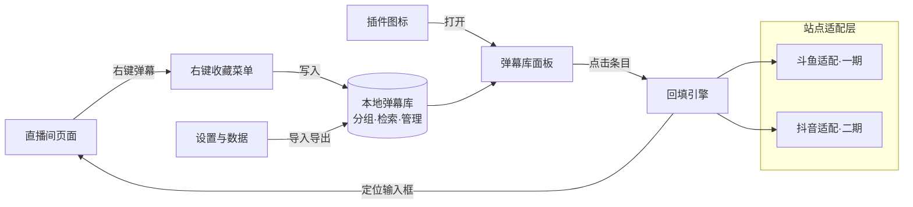
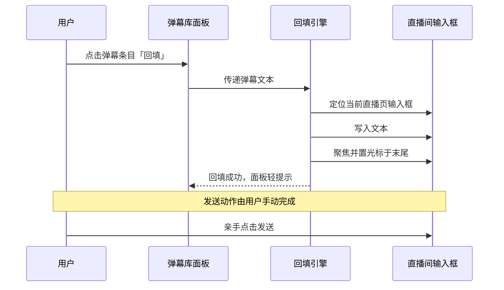
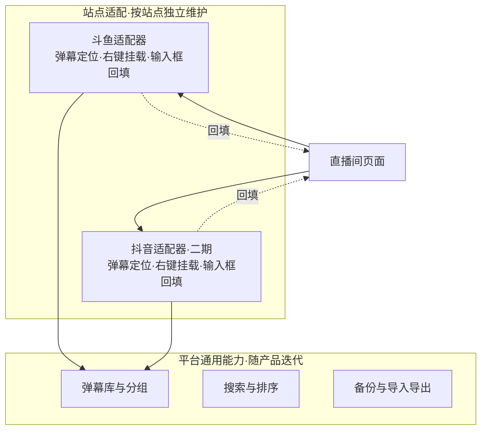

# 直播弹幕收藏管理插件 · 产品需求文档

| 文档属性 | 内容 |
|---------|------|
| 产品工作名 | 弹幕收藏夹（DanmakuBox） |
| 产品形态 | 浏览器扩展（Chrome Extension，Manifest V3） |
| 文档版本 | V1.2（评审修订稿） |
| 撰写日期 | 2026-08-28 |
| 撰写角色 | 产品经理 |
| 文档状态 | 评审修订（P0/P1 评审项已修正） |

### 修订记录

| 版本 | 日期 | 变更摘要 |
|------|------|---------|
| V1.0 | 2026-08-28 | 初稿：基于斗鱼/抖音可行性分析、DouyuEx 逆向分析三份调研编写 |
| V1.1 | 2026-08-28 | 并入直播间实地验证结论：关闭 Q4（弹幕字数上限 50 字实测确认）；FR-01 新增锁屏工具条遮挡处理；FR-02/FR-04 字数规则落地为实测值；FR-06 新增抖音登录前置与锚点策略（`#chatroom`、`data-e2e`）；FR-04 修正抖音未登录行为（输入框不渲染）；Q1/Q5 转入登录态验证清单，Q2 降级 |
| V1.2 | 2026-08-28 | 评审修订：FR-05 清空数据前自动生成临时备份（对齐第 7 章可挽回要求）；数据模型补设置对象，导出范围统一为弹幕+分组+设置；FR-05 明确导入合并时同名分组按名称合并、设置以当前库为准；FR-01/FR-06 落地降级两级原则（整站失效提示、局部缺失静默置灰）；FR-02 补手动新建去重规则；FR-03 补批量多选入口；FR-04 补空文本条目回填置灰 |

---

## 1. 需求背景

### 1.1 需求来源

本需求由产品发起人提出：希望做一个网页插件，用于收藏并管理直播网站的弹幕，数据保存在本地。一期适配斗鱼直播，二期扩展至抖音直播。

### 1.2 用户痛点

直播观众在长期观看过程中，积累了大量"想再次发送"的弹幕内容——应援口号、直播间梗、活动指令、整活文案。目前的发送方式存在三个具体问题：

**痛点一：好弹幕无处收藏。** 用户在直播间看到一句精彩弹幕，想留着自己以后用，只能手动复制到备忘录。备忘录与直播间割裂，复用时需要切窗口、找记录、复制、切回、粘贴，全程 5 步以上，多数用户在中途放弃。[PM 判断]

**痛点二：常用弹幕每次都要重新输入。** 主播发起抽奖、冲榜、带节奏活动时，往往要求观众刷指定弹幕（如"666"、活动口令、应援语）。用户每次都要重新打字或翻聊天记录找原句，活动节奏快时根本来不及。[PM 判断]

**痛点三：现有收藏能力各自为政、没有管理。** 斗鱼站内虽自带弹幕收藏，但数量有云端上限、无法分组、无法跨平台使用；抖音直播没有收藏能力。用户在不同直播间、不同平台之间无法复用积累的弹幕资产。[调研支持：斗鱼官方收藏接口存在且云端有上限，已通过插件逆向分析确认]

### 1.3 机会判断

- 弹幕收藏需求已被平台和第三方双重验证：斗鱼官方做了收藏功能（说明平台认可该需求），头部第三方插件 DouyuEx 专门为官方收藏做了"突破上限"的增强（说明官方能力不够用）。
- 该插件已于 2026 年停止维护（项目周期 2020-2026，官方已发布告别声明），其"弹幕无限收藏"能力随停服面临失效，市场上存在明确的能力空缺。[调研支持]
- 现有方案全部止步于"收藏"，没有任何产品做"管理"——分组、检索、跨平台。这是一个未被占据的差异化位置。[PM 判断]

---

## 2. 需求目标

### 2.1 产品定位

一款轻量的浏览器扩展，让直播观众把弹幕"收藏进来、管得清楚、一发即达"。不做直播增强全家桶，只围绕弹幕收藏与复用这一件事。

### 2.2 目标

产品处于 0 到 1 阶段，无既有数据基线，采用可量化的定性目标：

| # | 目标 | 衡量方式 |
|---|------|---------|
| G1 | 从"看到一条弹幕"到"完成收藏"不超过 2 次用户操作 | 操作路径走查 |
| G2 | 从"打开弹幕库"到"弹幕出现在输入框"不超过 3 次用户操作 | 操作路径走查 |
| G3 | 收藏数据 100% 存储在用户本地，产品不做任何云端上传与埋点 | 架构评审 + 隐私声明 |
| G4 | 一期斗鱼站内核心功能（收藏、管理、回填）全程可用，不依赖外部服务 | 功能验收 |
| G5 | 二期接入抖音时，不改弹幕库与分组的产品逻辑，仅新增站点适配 | 迭代评审 |

### 2.3 产品原则

- **本地优先**：所有数据存本地，可导出备份，用户对数据有完全控制权。
- **只回填不代发**：插件把弹幕填入输入框即止，发送动作始终由用户手动完成。直播平台对自动化发送有风控措施（抖音侧尤其明显，存在限流、验证码乃至封号风险），代发功能会给用户账号带来实际风险，产品层面不做。[调研支持：抖音可行性分析结论]
- **融入而非改造**：插件交互贴合直播站原有布局，不重排页面结构，不打断观看体验。

### 2.4 范围界定

一期（本文档覆盖）：斗鱼直播站的弹幕收藏、弹幕库与分组管理、回填输入框、本地数据备份。

二期（另行立项评审）：抖音直播站适配。弹幕库、分组、备份等功能为平台通用能力，二期直接复用。

明确不做：弹幕自动循环发送、弹幕内容审核过滤、云端同步与多设备账号体系、礼物签到等直播站其他功能的增强。

---

## 3. 市场与竞品分析

### 3.1 竞品对比

| 对比维度 | 斗鱼官方收藏 | DouyuEx（已停更） | 抖音直播现状 | 本产品 |
|---------|------------|-----------------|------------|--------|
| 弹幕收藏 | 有，云端存储 | 有，云端超限转存本地 | 无 | 有，纯本地 |
| 收藏数量上限 | 有（云端限制） | 无限（本地扩展） | — | 无限（本地存储） |
| 分组管理 | 无 | 无 | 无 | 有，核心能力 |
| 收藏后回填 | 有（站内收藏弹窗点击回填） | 有 | — | 有，跨分组检索后回填 |
| 跨平台 | 仅斗鱼 | 仅斗鱼 | — | 斗鱼 + 抖音（二期） |
| 维护状态 | 平台维护中 | 2026 年停更，仓库已删除 | — | 本产品 |
| 数据归属 | 平台云端 | 本地 + 云端混合 | — | 完全本地 |

### 3.2 结论

竞品实践给出的方法论是：**收藏本身是低门槛的存量能力，价值增量在"管理"与"复用半径"。** 官方收藏证明了需求存在，DouyuEx 证明了官方能力不足（上限、无管理），两者的共同缺口是分组与跨平台。本产品不做功能堆叠，把资源集中在竞品全部缺失的"管理"环节，并以"完全本地 + 跨平台"建立复用半径优势。DouyuEx 停更留下的存量用户迁移需求，是冷启动阶段可直接承接的种子用户来源。[PM 判断]

---

## 4. 用户与使用场景

### 4.1 目标用户

**画像 A：活动型观众（核心用户）**
活跃于 1-3 个固定直播间，日均观看 2 小时以上，粉丝牌等级较高。频繁参与抽奖、冲榜、盖楼等弹幕活动，拥有一批固定要发的弹幕。痛点强度高，使用频率高（每天多次），是口碑传播的源头。

**画像 B：整活型观众（重要用户）**
跨平台、跨直播间游走，喜欢收集和复用"梗弹幕"、玩梗文案、整活金句。对弹幕的组织能力（分组、搜索）敏感，收藏量大。使用频率中高，是数据量与功能深度的压力测试者。

### 4.2 核心场景（按优先级）

**场景 1：活动中快速应援（最高优先级）**
主播发起冲榜活动，要求观众刷指定口号。用户右键收藏口号弹幕到"应援"分组，此后每次活动打开弹幕库、点分组、点条目，弹幕落入输入框，手动发送。全程视线不离开直播间。

**场景 2：随手收藏好弹幕**
观看中看到一句精彩弹幕，右键收藏到默认分组，不打断观看。事后整理时再归组。

**场景 3：跨直播间复用**
用户在 A 直播间收藏的梗，在 B 直播间同样适用。弹幕库为平台级能力，任何已适配直播间内均可调出使用。

**场景 4：换机与备份**
用户更换浏览器或电脑，导出弹幕库文件，在新环境导入恢复全部收藏与分组。

### 4.3 用户故事

- 作为一名活动型观众，我希望右键一条弹幕就能收藏，这样活动时不用手动打字。
- 作为一名活动型观众，我希望把弹幕按用途分组，这样应援的时候能一眼找到该发的口号。
- 作为一名整活型观众，我希望点击收藏条目后弹幕自动填进输入框，这样我能跟上直播节奏。
- 作为一名整活型观众，我希望弹幕库能搜索，这样收藏多了以后也能立刻找到目标。
- 作为一名用户，我希望弹幕数据导出成文件备份，这样换设备时资产不丢失。

---

## 5. 术语表

| 术语 | 定义 |
|------|------|
| 弹幕 | 直播间内观众发送的滚动/列表展示的评论消息，本产品收藏与复用的对象 |
| 聊天区弹幕 | 直播页面侧边聊天列表中展示的弹幕，静止可悬停 |
| 飘屏弹幕 | 在视频画面上横向滚动的弹幕，处于运动状态 |
| 右键菜单 | 用户在弹幕上点击鼠标右键后，插件弹出的自定义操作菜单 |
| 原生右键面板 | 斗鱼站自带的弹幕右键操作面板，插件的自定义菜单需与其共存 |
| 弹幕库 | 插件提供的收藏管理面板，承载全部收藏弹幕的浏览、检索、管理 |
| 分组 | 用户自建的弹幕集合，用于按用途归类弹幕 |
| 回填 | 将收藏的弹幕内容自动写入当前直播页弹幕输入框的动作 |
| 站点适配 | 针对特定直播平台（斗鱼、抖音）做的界面定位与回填适配 |

---

## 6. 功能需求详述

### 6.0 功能架构总览



| 模块编号 | 模块名称 | 一句话描述 | 优先级 |
|---------|---------|-----------|--------|
| FR-01 | 弹幕右键收藏 | 在任意弹幕上右键，弹出收藏操作菜单 | P0 |
| FR-02 | 弹幕库面板 | 查看全部收藏弹幕，支持搜索与排序 | P0 |
| FR-03 | 分组管理 | 创建、编辑、删除分组，弹幕归组 | P0 |
| FR-04 | 弹幕回填 | 点击收藏弹幕，自动填入直播站输入框 | P0 |
| FR-05 | 数据存储与备份 | 本地存储模型、导出与导入 | P1 |
| FR-06 | 站点适配框架 | 斗鱼适配（一期）与抖音扩展（二期）的适配层 | P0（斗鱼）|

---

### 6.1 FR-01 弹幕右键收藏

#### 原型示意

```
┌─────────────────────────────── 直播间聊天区 ───────────────────────────────┐
│  小淳: 这波操作可以封神了                                                     │
│  阿拆: ┌──────────────────────┐                                             │
│  ↑     │  收藏到 ▸  应援口号  │  ← 右键菜单（跟随鼠标位置）                  │
│  右键   │            整活文案  │                                             │
│        │            默认收藏  │                                             │
│        ├──────────────────────┤                                             │
│        │  ✚ 收藏到新分组      │                                             │
│        │  ⧉ 复制弹幕文本      │                                             │
│        └──────────────────────┘                                             │
└─────────────────────────────────────────────────────────────────────────────┘
```

#### 页面布局

右键菜单为跟随鼠标位置的浮层，出现于点击坐标右下方，自动避免超出视口。菜单分两段：上段为分组目标列表（含最近使用的分组排前、末项"默认收藏"），下段为辅助操作（收藏到新分组、复制弹幕文本）。

#### 业务逻辑

用户在弹幕文本上按下鼠标右键时，插件捕获该弹幕的文本内容，冻结其当前展示状态（对飘屏弹幕需先暂停其滚动再弹出菜单），并展示右键菜单。用户点击任一分组后，插件将该弹幕写入弹幕库对应分组，菜单关闭，飘屏恢复滚动，页面右上角出现轻量提示"已收藏到「分组名」"，2 秒后自动消失。

菜单关闭条件：点击菜单外任意区域、按 Esc 键、鼠标移出菜单 500 毫秒以上。关闭后飘屏弹幕立即恢复运动。

#### 交互逻辑

| 用户动作 | 系统响应 |
|---------|---------|
| 右键聊天区弹幕文本 | 冻结目标弹幕，弹出菜单，分组列表按最近使用排序 |
| 右键飘屏弹幕文本 | 暂停全部飘屏运动，弹出菜单；关闭菜单后恢复 |
| 点击某分组 | 收藏写入，菜单关闭，toast 提示，飘屏恢复 |
| 点击"收藏到新分组" | 菜单切换为行内输入框，输入名称回车即完成收藏 |
| 点击"复制弹幕文本" | 文本进剪贴板，菜单关闭，toast"已复制" |
| 再次右键已收藏的弹幕 | 菜单中该弹幕已存在的分组显示"已收藏"标记，点击不重复写入 |

#### 字段规则

收藏时需提取并存储的弹幕信息：

| 字段 | 说明 | 必填 |
|------|------|------|
| 弹幕文本 | 弹幕的文字内容 | 是 |
| 来源平台 | 斗鱼 / 抖音（二期） | 是 |
| 来源房间 | 房间号或房间标识 | 是 |
| 收藏时间 | 收藏操作发生的时间 | 是，系统自动生成 |

#### 边界与异常

- **富内容弹幕**：弹幕含表情、图片等非文字元素时，只提取纯文本部分收藏，toast 中注明"已忽略表情/图片"。
- **空文本弹幕**：纯表情无文字的弹幕，"复制弹幕文本"置灰，收藏按钮可用但保存为空文本条目并以占位符展示。
- **与原生面板共存**：斗鱼聊天区右键会触发站方原生面板。插件自定义菜单在原生面板出现位置基础上偏移展示，两者互不遮挡；用户可在设置中关闭"聊天区右键收藏"，改用原生面板内的插件入口（该入口能力与自定义菜单一致）。[待确认：2026-08 实测发现未登录态右键不触发原生面板，共存方案的适用形态需在登录态下复测后再做设计评审]
- **悬浮工具条遮挡**：斗鱼聊天区顶部存在站方"锁屏/解锁"悬浮工具条（实测类名 `Barrage-topFloater`），会拦截其覆盖范围内弹幕条目的鼠标事件。右键监听与菜单定位需处理该遮挡：对被遮挡弹幕使用坐标级事件或临时提升菜单层级，收藏能力不得因工具条存在而失效。[实测支持：2026-08 斗鱼直播间验证发现]
- **超长弹幕**：菜单浮层内弹幕预览超过 2 行时截断显示，鼠标悬停可看全文。
- **页面 iframe 嵌套**：若弹幕位于嵌套页面内，右键能力不可用时，静默降级（不弹菜单、不报错），用户仍可通过弹幕库手动添加弹幕（见 FR-02）。

---

### 6.2 FR-02 弹幕库面板

#### 原型示意

```
┌─────────────────────────── 弹幕库面板 ───────────────────────────┐
│  弹幕收藏夹                                    [导入] [导出] [＋] │
│  🔍 搜索弹幕内容…                                共 128 条        │
├──────────┬──────────────────────────────────────────────────────┤
│ 全部弹幕  │  应援口号 · 12 条        排序: 最新▾                  │
│ ★ 默认收藏│ ┌────────────────────────────────────────────────┐   │
│   应援口号│ │ 666冲冲冲                        [斗鱼·房间A] 3天前│
│   整活文案│ │                    [回填] [移动▸] [编辑] [删除]  │   │
│   活动口令│ ├────────────────────────────────────────────────┤   │
│   …      │ │ 主播生日快乐！！                  [斗鱼·房间B] 1周前│
│          │ │                    [回填] [移动▸] [编辑] [删除]  │   │
│ ＋ 新建分组│ └────────────────────────────────────────────────┘   │
├──────────┴──────────────────────────────────────────────────────┤
│  存储用量 2.1MB / 10MB          本地存储 · 不上传云端             │
└─────────────────────────────────────────────────────────────────┘
```

#### 页面布局

面板为点击浏览器工具栏插件图标后展开的独立面板页，宽约 720px。分三区：顶部为标题与全局操作（搜索框、导入导出、新建弹幕）；左列为分组导航（全部弹幕、默认收藏、用户分组、新建入口）；右侧主体为当前分组的弹幕列表，每条弹幕占一行，展示内容、来源、收藏时间与行内操作。底部常驻显示本地存储用量与"本地存储·不上传"声明。

#### 业务逻辑

面板打开时从本地存储读取全部数据，默认选中"全部弹幕"分组，列表按收藏时间倒序排列。用户在搜索框输入关键词后，列表实时过滤为内容包含该关键词的弹幕，搜索范围始终限定在当前选中的分组内，选中"全部弹幕"时为全库搜索。点击任一分组，右侧切换为该分组内容并显示计数。每条弹幕的行内操作：回填（见 FR-04）、移动分组、编辑内容、删除。

"＋"号新建弹幕允许用户手动录入一条弹幕并选择分组，用于收藏站外看到的文案。录入内容与目标分组内已有条目完全一致时，提示"该分组已收藏此弹幕"并不重复写入，去重规则与右键收藏一致（见 FR-01 交互逻辑）。

#### 交互逻辑

| 用户动作 | 系统响应 |
|---------|---------|
| 点击工具栏插件图标 | 打开弹幕库面板，恢复上次选中的分组 |
| 输入搜索关键词 | 列表实时过滤，无结果显示空态"没有找到相关弹幕" |
| 点击排序切换 | 在"最新收藏 / 最早收藏 / 内容长度"间切换 |
| 点击"编辑" | 该行切换为输入框，回车保存，Esc 取消 |
| 点击"删除" | 行内确认提示"删除后不可恢复"，确认后删除；支持撤销 toast（5 秒内可恢复）[待确认：撤销交互是否一期实现] |
| 点击"新建分组" | 左列出现行内输入框，回车创建并选中 |
| 点击存储用量区 | 展开容量说明与清理建议（见 FR-05） |

#### 字段规则

| 字段 | 类型 | 必填 | 长度/范围 | 默认 |
|------|------|------|----------|------|
| 搜索关键词 | 文本 | 否 | 1-50 字符 | 空 |
| 弹幕内容（手动新建/编辑） | 文本 | 是 | 1-50 字符（斗鱼输入框实测上限 `maxlength=50`，2026-08 验证；后续站点不同上限由各站适配层维护，编辑时按来源平台校验） | 空 |
| 排序方式 | 枚举 | 是 | 最新/最早/内容长度 | 最新收藏 |
| 列表每页条数 | 数值 | 是 | 50 条，滚动加载更多 | 50 |

#### 边界与异常

- **空库状态**：无任何收藏时，主区展示引导插画与三步说明（右键收藏 → 分组管理 → 点击回填），并提供"手动添加第一条弹幕"入口。
- **空分组状态**：分组存在但无弹幕时，提示"该分组还没有弹幕，去直播间右键收藏或手动添加"。
- **搜索无结果**：展示空态与"清除搜索"按钮。
- **数据量较大**：千条级弹幕下，列表滚动与搜索响应均应在 300 毫秒内完成（见第 7 章性能要求）。
- **存储读取失败**：面板顶部出现警示条"本地数据读取失败"，提供重试与导出诊断信息入口，不白屏。

---

### 6.3 FR-03 分组管理

#### 原型示意

```
┌─ 分组导航（弹幕库左列）─────────────────┐
│  全部弹幕 (128)                         │
│  ★ 默认收藏 (23)          ← 不可删除    │
│  ● 应援口号 (12)  ⋮                      │
│  ● 整活文案 (45)  ⋮                      │
│  ● 活动口令 (8)   ⋮    点击 ⋮ 弹出：    │
│                                          │   重命名
│  ＋ 新建分组                              │   排序拖拽
│                                          │   删除分组
└──────────────────────────────────────────┘
   删除确认弹窗：
   ┌────────────────────────────────────┐
   │ 删除分组「活动口令」？               │
   │ 组内 8 条弹幕将移入「默认收藏」，     │
   │ 不会被删除。           [取消] [删除] │
   └────────────────────────────────────┘
```

#### 业务逻辑

系统内置一个不可删除、不可重命名的"默认收藏"分组，所有未指定分组的收藏（含右键快捷收藏）落入此处。用户可创建自定义分组，上限 50 个[假设-待验证：结合存储与导航体验确定]。分组支持重命名与拖拽排序，顺序在弹幕库左列与 FR-01 右键菜单中保持一致。删除分组时组内弹幕不删除，整体移入"默认收藏"，删除前弹窗明确告知移动数量。

弹幕归组的路径有四条：右键收藏时选定分组（FR-01）、弹幕库内单条"移动"（FR-02）、弹幕库内多选批量移动、手动新建弹幕时选定分组。

#### 交互逻辑

| 用户动作 | 系统响应 |
|---------|---------|
| 新建分组 | 行内输入名称，回车创建；重名时提示"分组名已存在" |
| 重命名分组 | 行内编辑，回车保存，全库即时生效 |
| 拖拽分组 | 左列顺序调整，松手即保存 |
| 删除自定义分组 | 弹出确认弹窗，注明组内弹幕数量及去向，确认后执行移动+删除 |
| 删除"默认收藏" | 操作置灰，悬停提示"内置分组不可删除" |
| 点击列表上方"批量管理"按钮 | 列表进入复选框模式（按钮切换为"退出批量"），选中后底部浮出批量操作栏（移动、删除）；按 Esc 或再点一次退出，不保留选中态 |
| 单条移动 | 弹出分组选择浮层（含"新建分组"项），点击即完成移动 |

#### 字段规则

| 字段 | 类型 | 必填 | 长度/范围 | 默认 |
|------|------|------|----------|------|
| 分组名称 | 文本 | 是 | 1-12 字符 | 空 |
| 分组数量 | 数值 | — | 上限 50 个 | 内置 1 个 |
| 分组排序 | 序列 | — | 拖拽自由排序 | 创建时间顺序 |

#### 边界与异常

- **分组名边界**：首尾空格自动去除；纯空格、超长名称输入时即时拦截并提示。
- **批量操作上限**：单次批量移动/删除无数量限制，但执行中展示进度，完成后汇总 toast"已移动 N 条"。
- **删除后恢复**：分组删除不可恢复，但被移动的弹幕完整保留在"默认收藏"，弹窗文案需明确表达这一点，避免用户误以为弹幕被删。

---

### 6.4 FR-04 弹幕回填

#### 原型示意



#### 业务逻辑

用户在弹幕库点击某条弹幕（或其"回填"按钮）后，插件将文本写入当前活动标签页的直播弹幕输入框，写入后输入框获得焦点、光标停在文本末尾，弹幕库面板给出"已回填"轻提示。回填后插件的工作即结束，发送由用户亲手完成，这是产品原则（见 2.3），也是对用户账号安全的保护。

回填目标为"当前浏览器活动标签页中已适配的直播间"。若该标签页不是直播间或站点未适配，回填按钮置灰并提示原因。

#### 交互逻辑

| 用户动作 | 系统响应 |
|---------|---------|
| 点击弹幕条目（主操作区） | 回填到输入框，面板顶部 toast"已回填，可直接发送"，输入框聚焦 |
| 连续点击多条弹幕 | 后一次回填覆盖前一次内容（默认替换模式） |
| 设置中开启"追加模式" | 多次回填时以换行/空格衔接已有内容[低优先级：拼接发送的站内校验行为未实测，随 Q2 决策一并处理] |
| 回填超长弹幕 | 文本超过平台输入上限时，填入至上限并 toast"内容超出平台字数限制，已截断" |
| 空文本条目回填 | "回填"置灰，悬停提示"该弹幕无文本内容，无法回填"，与 FR-01 空文本弹幕的置灰规则一致 |
| 当前页非直播间 | "回填"置灰，悬停提示"请在斗鱼直播间页面使用"（二期增加抖音提示） |
| 输入框未登录（抖音二期） | 回填不可用：未登录时抖音输入框不渲染（2026-08 实测，全页无 contenteditable 元素）。插件提示"登录后即可使用弹幕回填"并给出登录引导，不阻塞弹幕库其他功能[实测支持] |

#### 字段规则

| 配置项 | 类型 | 可选值 | 默认 |
|--------|------|--------|------|
| 回填模式 | 枚举 | 替换 / 追加 | 替换 |
| 回填后行为 | 枚举 | 仅聚焦输入框 / 聚焦并高亮已填内容 | 仅聚焦输入框 |
| 平台字数上限 | 数值 | 按站点适配层维护，随站点更新 | 斗鱼 50 字（2026-08 实测确认） |

#### 边界与异常

- **输入框形态差异**：斗鱼站内输入框存在新旧两种实现形态（textarea / contenteditable div），回填引擎需同时兼容，用户无感知。此为适配层内部要求，产品验收以"两个形态下回填均成功"为准。2026-08 实测确认：当前线上为 DIV + contenteditable 形态，"写入 innerText + 派发 input 事件"的回填范式在该页面执行成功，回填技术路线无阻塞。[实测支持]
- **直播页改版**：站点改版导致输入框定位失败时，回填按钮置灰并提示"直播页已改版，回填暂不可用，请等待插件更新"，同时引导用户使用"复制弹幕文本"兜底。
- **回填后站内校验**：个别场景下站点会对输入内容做前端校验（如敏感词），插件不干预校验结果，由站点自身逻辑处理。
- **多标签页**：仅向当前活动标签页回填，不出现跨标签页误写。

---

### 6.5 FR-05 数据存储与备份

#### 原型示意

```
┌─ 设置 · 数据管理 ────────────────────────────────┐
│                                                   │
│  存储位置     本地（浏览器扩展存储）               │
│  当前用量     2.1MB / 10MB   [用量明细]           │
│                                                   │
│  [导出备份]  导出 JSON 文件，含弹幕、分组、设置    │
│  [导入恢复]  支持合并导入 / 覆盖导入               │
│                                                   │
│  ▸ 清空全部数据（需二次确认）                      │
└───────────────────────────────────────────────────┘

  导入冲突策略弹窗：
  ┌─────────────────────────────────────┐
  │ 检测到备份文件中有 12 条弹幕与当前   │
  │ 库内容重复。                        │
  │  ○ 合并：跳过重复，保留两边的分组    │
  │  ● 覆盖：以备份文件为准替换当前库   │
  │                      [取消] [执行]  │
  └─────────────────────────────────────┘
```

#### 业务逻辑

全部数据（弹幕、分组、设置）存储于浏览器本地扩展存储，无任何云端交互。用户可将全库（弹幕、分组、设置）导出为 JSON 文件用于备份或迁移；导入时提供"合并"与"覆盖"两种策略：合并跳过内容与分组均重复的条目，备份与当前库存在同名分组（标识不同）时按名称合并为一个分组、备份中该组的弹幕归入合并后的分组，设置项以当前库为准；覆盖则以备份文件整体替换当前库（替换前自动生成一份当前库的临时备份文件供下载）。清空全部数据在执行前同样自动生成当前库的临时备份下载，与第 7 章"破坏性操作必须可挽回"的要求对齐。存储用量在弹幕库底部与设置页常驻可见，接近容量上限（80%）时提醒用户导出备份并清理。

#### 交互逻辑

| 用户动作 | 系统响应 |
|---------|---------|
| 点击"导出备份" | 生成文件名含日期的 JSON 文件（含弹幕、分组、设置）并触发下载 |
| 点击"导入恢复" | 选择文件后校验格式，展示冲突策略弹窗，执行后汇总"新增 N 条、跳过 M 条" |
| 导入格式非法 | 提示"文件格式不正确，请使用本产品导出的备份文件"，不执行任何写入 |
| 用量达 80% | 弹幕库底部条变警示色，提示导出与清理建议 |
| 清空全部数据 | 二次确认（输入"清空"二字确认[待确认：交互强度]），确认后先自动下载当前库临时备份，再执行清空，完成后回到空库引导态 |

#### 字段规则

数据模型（备份文件与本地存储共用）：

| 对象 | 字段 | 说明 |
|------|------|------|
| 弹幕 | id | 唯一标识 |
| 弹幕 | content | 弹幕文本 |
| 弹幕 | group_id | 所属分组，关联分组对象 |
| 弹幕 | created_at | 收藏时间 |
| 弹幕 | platform | 来源平台（douyu / douyin） |
| 弹幕 | room | 来源房间标识 |
| 分组 | id / name / order | 标识、名称、排序位 |
| 设置 | key / value | 全局设置键值对：回填模式、回填后行为、聊天区右键收藏开关等（见 FR-04 字段规则） |
| 设置 | last_selected_group | 弹幕库上次选中的分组，用于打开面板时恢复状态（见 FR-02） |
| 备份文件 | version | 数据结构版本号，向前兼容导入 |

#### 边界与异常

- **跨版本兼容**：导入旧版本备份文件时按 version 字段迁移数据结构，迁移失败时中止并保留原库完整无损。
- **存储写入失败**：收藏操作写入失败时 toast 明确告知"存储空间不足，收藏未成功"，并引导清理，不做静默丢数据。
- **并发修改**：多窗口同时操作弹幕库时，以最后写入为准，不额外做同步锁[待确认：多窗口场景出现频率]。

---

### 6.6 FR-06 站点适配框架

#### 原型示意



#### 业务逻辑

产品按"通用层 + 适配层"组织：弹幕库、分组、搜索、备份是平台无关的通用能力；每个直播站点一个适配器，负责该站的弹幕定位（供右键收藏）、输入框定位（供回填）、站点特有交互处理。一期交付斗鱼适配器，弹幕覆盖聊天区弹幕与视频区飘屏弹幕两条路径[调研支持：两条路径均为可交互的页面元素，已验证]；二期交付抖音适配器，覆盖评论列表路径，飘屏路径视技术验证结果决定是否纳入[调研支持：抖音飘屏路径可行性低于聊天区，需实测]。

2026-08 直播间实地验证为两站适配补充了直接证据：

- **斗鱼**：输入框、发送按钮、弹幕列表、弹幕条目、弹幕文本、官方收藏入口等核心语义选择器在距 DouyuEx 停更约 3 个月后全部有效；飘屏弹幕哈希类名已变更（`danmu-e7f029` → `danmu-fbb2a3`），印证适配层选择器策略——语义类名为稳定主干，哈希类名仅作运行时探测项，不作为硬依赖。[实测支持]
- **抖音**：类名为纯哈希（无语义前缀），但页面保留 `#chatroom` 稳定 ID 与成体系的 `data-e2e` 测试属性（15+ 个），适配器锚点优先采用该体系，稳定性高于哈希类名；弹幕数据通道确认为 WebSocket 推送（`webcast/im/push/v2`），为 DOM 路径受阻时的协议层备选。[实测支持]

适配层对站点改版的响应方式是产品体验的一部分，降级提示按两级处理：**整站适配失效**（进入直播间后核心锚点探测失败）不得静默无响应，必须给出明确的状态提示（见 FR-04 边界），并在插件更新日志中标注恢复情况；**局部能力缺失**（如弹幕位于嵌套 iframe 内右键不可用、飘屏路径定位失败）则该能力入口置灰或静默跳过，不打扰观看、不影响其余功能。FR-01 的 iframe 场景即属后者。

#### 交互逻辑

| 场景 | 用户感知 |
|------|---------|
| 进入已适配直播间 | 插件图标激活（点亮），右键弹幕可用 |
| 进入未适配站点/页面 | 插件图标置灰，右键菜单不出现，无报错 |
| 抖音未登录进入直播间（二期） | 聊天区仅显示观众列表与"需登录"提示，弹幕与输入框均未渲染；插件提示"登录后可收藏与回填弹幕"并给出登录引导，弹幕库浏览、分组、备份功能不受影响[实测支持：2026-08 验证未登录态弹幕列表不渲染] |
| 站点改版导致定位失败 | 弹幕库内显示"斗鱼适配暂不可用"状态条，回填置灰并给出兜底（复制文本） |
| 适配恢复（插件更新后） | 状态条自动消失，无需用户任何操作 |

#### 边界与异常

- **斗鱼飘屏弹幕**：飘屏处于持续运动中，右键交互需以"暂停-操作-恢复"方式处理（FR-01 已定义），验收时需覆盖高中低三档弹幕密度下的可点性。
- **抖音登录态（实测修正）**：2026-08 实测发现，抖音未登录状态下弹幕列表与输入框均不渲染（与斗鱼"未登录可看弹幕、可回填"形成平台差异），因此抖音侧"登录"是收藏与回填的共同前置条件，而非仅发送的前置条件。二期验收标准需包含：未登录时的功能降级提示与登录引导；登录后弹幕列表渲染、右键收藏、回填全链路可用。插件不做任何代登录或代发行为。[实测支持]
- **新站点扩展**：三期及以后的新站点适配不改动通用层，本文档 6.1-6.5 的产品逻辑对任意新站点直接适用。

---

## 7. 非功能需求

| 类别 | 要求 |
|------|------|
| 性能 | 弹幕库面板打开 ≤ 500ms；千条弹幕下搜索响应 ≤ 300ms；右键菜单弹出 ≤ 100ms；回填动作 ≤ 200ms 内完成写入与聚焦 |
| 隐私 | 不采集任何用户行为数据，不内置统计上报，不请求与产品功能无关的外部网络资源；隐私声明在安装页明示 |
| 数据安全 | 全部数据本地存储；清空、覆盖导入等破坏性操作必须二次确认且可挽回（临时备份或撤销窗口） |
| 兼容性 | 一期支持 Chrome 与 Chromium 内核浏览器（Edge 等）的最新两个大版本；Manifest V3 规范 |
| 账号安全 | 不模拟、不代替用户执行发送动作；不接触用户账号凭据；交互设计避开平台风控敏感的自动化行为 |
| 稳定性 | 单一功能模块异常不拖垮页面与面板；站点定位失败时降级提示而非报错中断 |

---

## 8. 开放问题

| # | 问题 | 影响 | 状态（V1.1 更新） | 建议决策人 |
|---|------|------|------------------|-----------|
| Q1 | 斗鱼原生右键面板与插件自定义菜单的共存形态（偏移并排 / 原生面板内注入入口 / 替换） | FR-01 核心交互 | 待登录态复测：2026-08 未登录实测右键不触发原生面板，共存方案需登录环境验证后决策 | 产品 + 设计 |
| Q2 | 回填"追加模式"在各平台的实际可用性（站点是否允许拼接内容发送） | FR-04 配置项取舍 | 降级为低优先级：发送链路涉及账号风控，按"只回填不代发"原则暂不投入实测 | 产品 + 研发 |
| Q3 | 删除操作的撤销窗口（5 秒 toast）是否纳入一期 | FR-02 开发量 | 保留 | 产品 |
| Q4 | 弹幕与分组名称的字数上限终值 | FR-02 / FR-03 字段规则 | **已关闭**：斗鱼输入框实测上限 50 字（2026-08），弹幕内容字段已按 50 字落地（见 FR-02）；分组名 12 字维持 | 产品 + 研发 |
| Q5 | 抖音飘屏弹幕路径是否纳入二期范围 | FR-06 二期范围 | 待登录态验证：未登录状态下抖音弹幕 DOM 不渲染，无法探测飘屏实现方式，随二期登录态验证一并裁决 | 产品 |
| Q6 | 清空数据的二次确认强度（普通确认弹窗 / 输入文字确认） | FR-05 交互细节 | 保留 | 设计 |

发版前需以真实登录会话执行一轮复测，覆盖 Q1（斗鱼登录态右键面板）与 Q5（抖音登录态弹幕 DOM 结构），复测方法与 2026-08 实地验证一致，成本相当；其余开放问题随原型设计评审决策。

---

*文档完 · V1.2 评审修订完成，进入原型设计与技术方案评审阶段*
