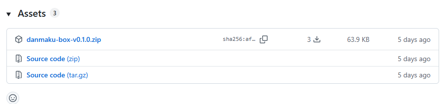
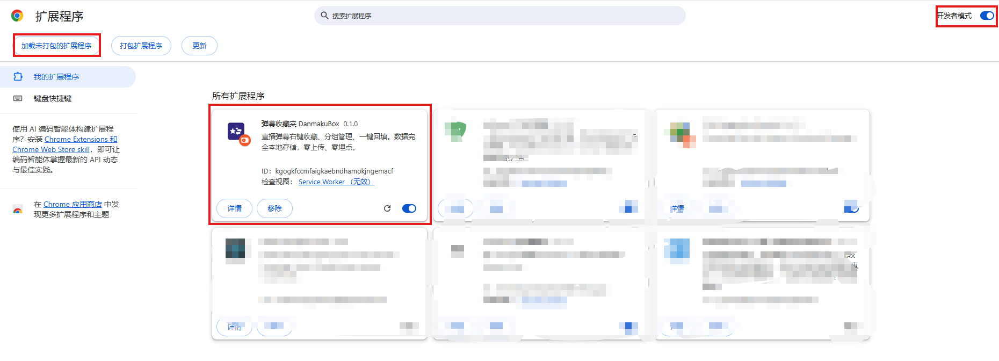
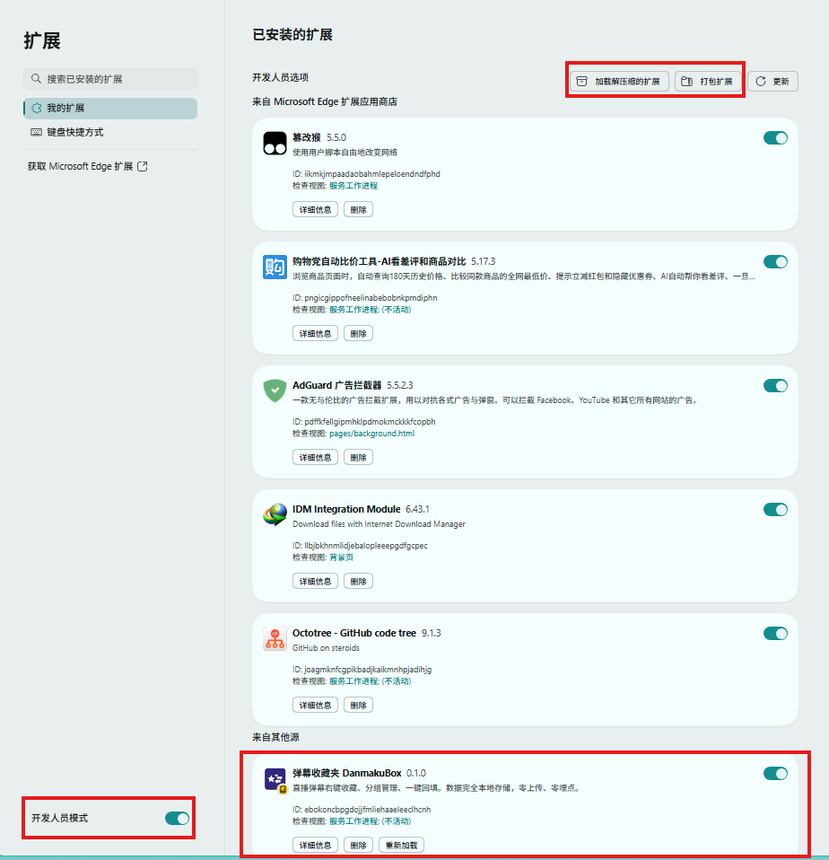
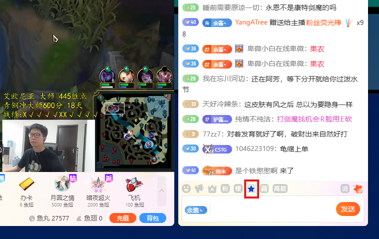
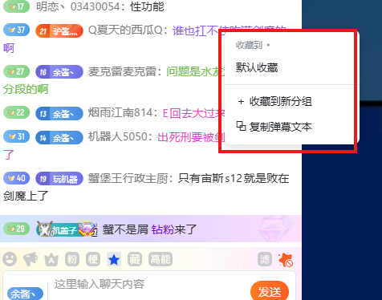
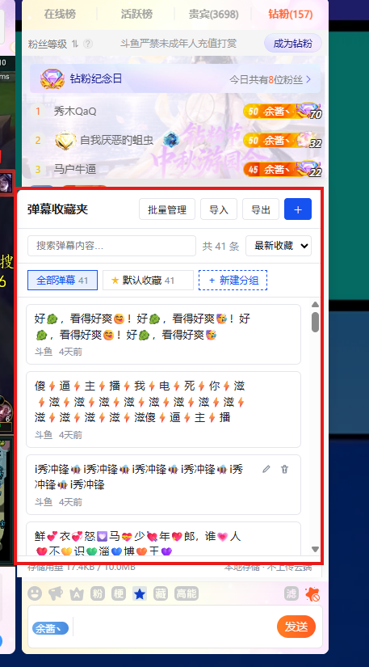

# 弹幕收藏夹 DanmakuBox · 安装与使用说明

一款轻量的浏览器扩展：**右键收藏直播弹幕、分组管理、一键回填到直播间输入框**。

- 支持站点：**斗鱼直播**、**抖音直播**
- 数据 100% 保存在你的浏览器本地（`chrome.storage.local`），**零上传、零埋点**，不需要注册任何账号
- 只回填不代发：插件只把弹幕填进输入框，发送按钮始终由你亲手点，安全不封号

---

## 一、安装前准备

| 项目 | 要求 |
| --- | --- |
| 浏览器 | Chrome 114 及以上，或 Edge 114 及以上（Chromium 内核） |
| 磁盘 | 约 1MB，另需保留一个固定文件夹用于存放扩展文件 |
| 账号 | 无需注册；抖音站内回填需登录抖音 |

> 同一个扩展包同时支持 Chrome 与 Edge，下载一次即可。

---

## 二、下载扩展包

1. 打开 Releases 页面：<https://github.com/forzenfox/danmaku-box/releases>
2. 找到最新版本（当前为 `v0.1.0`）
3. 在 **Assets** 区域点击下载 `danmaku-box-v0.1.0.zip`

> **网络提示**：GitHub 在国内访问可能较慢或超时。若打不开，请更换网络环境或使用代理后重试。



---

## 三、Chrome 浏览器安装

1. 打开 Chrome，地址栏输入并回车：

   ```
   chrome://extensions
   ```

   （也可以点右上角「⋮」→「扩展程序」→「管理扩展程序」）

2. 打开页面**右上角**的「**开发者模式**」开关

3. 把下载的 `danmaku-box-v0.1.0.zip` **解压到一个固定目录**（例如 `D:\danmaku-box`）

   > ⚠️ zip 内部**没有再套一层文件夹**，所以请不要直接解压到「下载」目录（文件会散落一地）。请用「解压到 danmaku-box-v0.1.0\」这类会自动新建文件夹的选项，或者先手动建好一个空文件夹再解压进去。

4. 解压正确的话，目录结构应该是这样（**根目录下直接就是 `manifest.json`**）：

   ```
   danmaku-box/            ← 安装时要选中这一层
   ├── manifest.json       ← 必须有这一个文件
   ├── background.js
   ├── content.js
   ├── panel.html
   ├── panel.js
   ├── panel.css
   ├── settings.html
   ├── settings.js
   ├── settings.css
   └── icons/
   ```

5. 点击页面**左上角**的「**加载已解压的扩展程序**」

6. 在弹出的文件夹选择框中，选中**解压出来的那个目录**（即直接包含 `manifest.json` 的目录），点击「选择文件夹」

7. 安装成功：页面出现卡片「**弹幕收藏夹 DanmakuBox**」

8. 建议点击工具栏的拼图图标 🧩，把「弹幕收藏夹」点成图钉状态，固定到地址栏右侧，方便随时打开弹幕库

> 如果选错了目录（例如选到了上一层的「下载」文件夹），会提示「清单文件缺失或不可读」，重新点「加载已解压的扩展程序」选中正确目录即可。
>
> 安装后**不要删除或移动这个文件夹**，浏览器每次启动都要读取它。



---

## 四、Edge 浏览器安装

Edge 与 Chrome 步骤几乎一样，只是页面地址和按钮文案略有不同。

1. 打开 Edge，地址栏输入并回车：

   ```
   edge://extensions
   ```

   （也可以点右上角「…」→「扩展」）

2. 打开页面**左下角**的「**开发人员模式**」开关

3. 把 zip **解压到一个固定目录**（目录结构与 Chrome 第 4 步一致，根目录下直接是 `manifest.json`）

4. 点击页面上的「**加载解压缩的扩展**」

5. 选中**解压出来的那个目录**（即直接包含 `manifest.json` 的目录）

6. 安装成功：列表出现「**弹幕收藏夹 DanmakuBox**」

7. 点击工具栏的「扩展」图标，把插件固定到工具栏

> 同样注意：安装后**不要删除或移动这个文件夹**。



---

## 五、三步上手

### 第 1 步：进入直播间，找到蓝色的收藏星标

打开斗鱼或抖音的直播间页面后，聊天区会出现一个 **18×18 的蓝色五角星图标**（浅蓝圆角底 + 实心蓝星，与站点自带的单色小图标风格一致）：

| 站点 | 图标位置 |
| --- | --- |
| 斗鱼 | 聊天区底部工具栏，位于「高能」与官方收藏按钮之间 |
| 抖音 | 聊天输入框最左侧（未登录时显示在聊天区的登录提示条上） |

点击这颗蓝色星标，即可在直播间内直接展开「弹幕库」面板。



### 第 2 步：右键收藏弹幕

在**任意一条弹幕**上点击鼠标右键 → 在弹出菜单里选择目标分组：

- 「收藏到 ▸ 分组名」——直接存入已有分组
- 「＋ 收藏到新分组」——输入名称回车，边收藏边建组
- 「⧉ 复制弹幕文本」——只复制不收藏

斗鱼的**聊天区弹幕**和视频画面上滚动的**飘屏弹幕**都支持右键收藏（右键飘屏时画面会先停住，选完自动恢复）。收藏成功右上角会提示「已收藏到「分组名」」。



### 第 3 步：点击弹幕回填，手动发送

打开弹幕库面板 → **单击任意一条弹幕内容**，弹幕文字会自动填进直播间的输入框，光标停在末尾 → 你确认无误后**自己点发送**。

> 插件不做自动发送，也不会代替你操作账号。



---

## 六、弹幕库面板能做什么

| 区域 | 能力 |
| --- | --- |
| 顶部操作 | 批量管理、导入、导出、＋ 手动新建弹幕 |
| 搜索框 | 在当前分组内实时搜索弹幕内容 |
| 排序 | 最新收藏 / 最早收藏 / 内容长度 |
| 左侧分组导航 | 「全部弹幕」「默认收藏」+ 自建分组；「＋ 新建分组」；分组名旁悬停出现 ⋮ 可重命名、删除（删除分组不会删弹幕，弹幕会移入「默认收藏」） |
| 弹幕列表 | 单击 = 回填；鼠标悬停出现 ✎ 编辑、🗑 删除（删除需二次确认）；批量模式下勾选后可批量移动/删除 |
| 底部 | 存储用量、本地存储声明 |

**面板入口有两个**：

- 直播间页面：点聊天区的蓝色星标
- 其他页面：点浏览器工具栏的插件图标，会打开侧边栏面板

