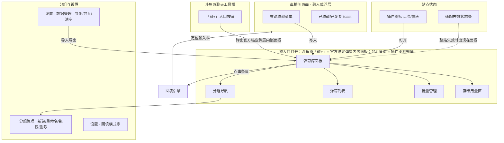
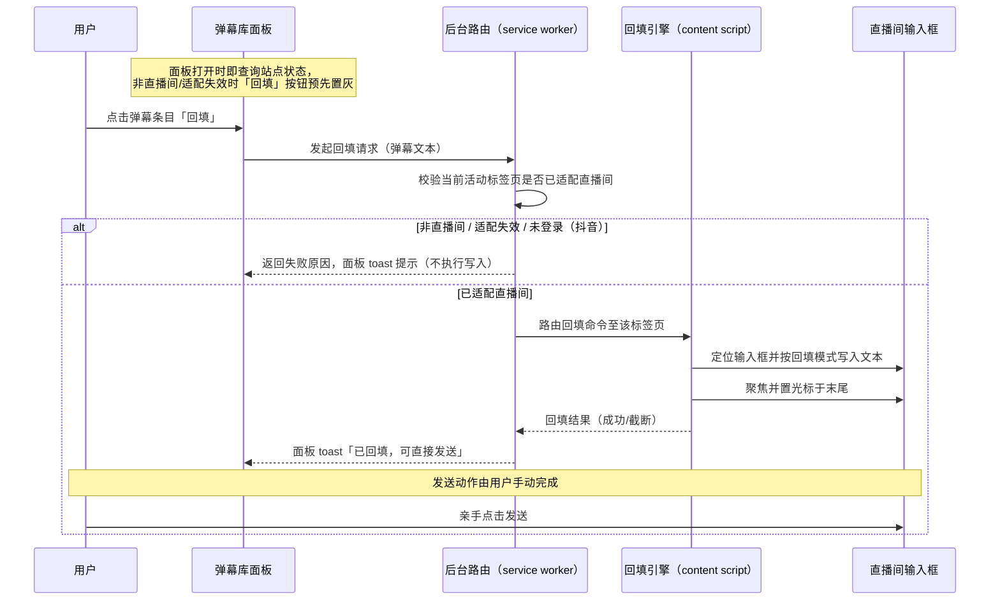

# 弹幕收藏管理插件 · 原型设计文档

| 文档属性 | 内容 |
|---------|------|
| 产品工作名 | 弹幕收藏夹（DanmakuBox） |
| 文档版本 | V0.2（评审修订稿） |
| 撰写日期 | 2026-08-28 |
| 撰写角色 | 交互设计 |
| 上游文档 | PRD V1.2（评审修订稿） |
| 文档状态 | 评审修订（原型评审 P1/P2 项已修正） |

### 修订记录

| 版本 | 日期 | 变更摘要 |
|------|------|---------|
| V0.1 | 2026-08-28 | 初稿：基于 PRD V1.2 编写 |
| V0.2 | 2026-08-28 | 原型评审修订：toast 区分页面/面板两类宿主并统一各处表述；回填时序图重画（站点校验主体改为后台路由，置灰为面板打开时预判）；右键菜单 ASCII 去除已收藏标记展示歧义；分组 ⋮ 菜单移除"排序拖拽"项（拖拽直接在左列进行）；批量模式行内操作隐藏规则；G1/G2 补操作计数口径 |
| V0.3 | 2026-09-07 | 新增斗鱼页「藏+」工具栏入口与官方锚定弹层形态（替代右侧悬浮抽屉方案），实测基线见 3.2.5 |

> 本文档为 PRD V1.2 的原型设计承接稿，逐条继承 PRD 中 FR-01 ~ FR-06 的字段规则、边界异常与交互表，以线框与状态说明的形式落地界面表现。PRD 中标注「待确认 / 待验证」的开放问题（Q1/Q2/Q3/Q6 等）在本文档中以「原型默认值 + 待评审标注」处理，详见第 5 章差异说明。

---

## 1. 设计说明

### 1.1 目的与范围

本文档覆盖弹幕收藏夹（DanmakuBox）一期（斗鱼直播站）的全部界面原型，包含六个模块：

| 编号 | 模块 | 对应 PRD | 优先级 |
|------|------|---------|--------|
| 3.1 | 右键收藏菜单 | FR-01 | P0 |
| 3.2 | 弹幕库面板 | FR-02 | P0 |
| 3.3 | 分组管理 | FR-03 | P0 |
| 3.4 | 弹幕回填 | FR-04 | P0 |
| 3.5 | 设置与数据管理 | FR-05 | P1 |
| 3.6 | 站点状态与降级 | FR-06 | P0（斗鱼） |

原型目标：为每个模块确定「布局分区、视觉层级、交互状态、边界表现」，作为视觉稿与前端实现的前置依据。本文档只描述交互与界面表现，不涉及代码实现细节。

### 1.2 设计原则

原型设计遵循 PRD 第 2.3 节的三大产品原则，并落地为具体交互约束：

1. **本地优先**：所有数据操作（收藏、编辑、导入导出、清空）均在本地面板内完成，界面明确标注「本地存储 · 不上传云端」；破坏性操作必须可挽回（临时备份或明确去向）。
2. **只回填不代发**：任何界面上都不出现「自动发送」「循环发送」类控件；回填动作止步于输入框聚焦，发送按钮始终由用户手动点击。产品原则不允许通过交互设计绕开。
3. **融入而非改造**：右键菜单、toast、状态条均为轻量浮层，不重排直播间布局，不打断观看；降级提示优先采用「置灰 + 悬停说明」而非弹窗打断。

### 1.3 通用交互规范

以下规则在本产品全部界面统一生效，各页面章节不再重复定义。

#### 1.3.1 toast 统一规则

toast 按宿主分两类，各自独立生效：

| 项目 | 页面 toast（宿主：直播间页面） | 面板 toast（宿主：弹幕库面板） |
|------|------------------------------|------------------------------|
| 承载场景 | 右键收藏、复制弹幕文本 | 回填结果、导入导出结果、批量操作汇总、编辑保存 |
| 位置 | 页面右上角，与直播间 toast 位置一致，避免遮挡聊天区 | 面板顶部工具栏下方，右对齐 |
| 时长 | 默认 2 秒后自动消失 | 默认 2 秒后自动消失 |
| 层级 | 悬浮于直播间内容之上 | 悬浮于面板内容之上，不遮挡分组导航 |
| 类型 | 成功（正常色）、警示（「已忽略表情/图片」等富内容提示） | 成功（正常色）、警示（警示色，「存储不足」「存储读取失败」等不可静默场景） |
| 文案 | 一律以「已……」开头陈述结果，如「已收藏到「应援口号」」「已复制」 | 同左，如「已回填，可直接发送」「已移动 5 条」「导入完成：新增 N 条、跳过 M 条」 |

> 分类依据：页面类操作发生在直播间上下文（右键菜单、复制），提示就近反馈；面板类操作发生在面板上下文（回填、导入、批量），提示在面板内闭环，不打扰直播画面。

#### 1.3.2 空态统一规则

| 场景 | 统一表现 |
|------|---------|
| 整库为空 | 主区展示引导插画 + 三步说明（右键收藏 → 分组管理 → 点击回填），并提供「手动添加第一条弹幕」入口 |
| 单个分组为空 | 提示「该分组还没有弹幕，去直播间右键收藏或手动添加」，不展示插画 |
| 搜索无结果 | 提示「没有找到相关弹幕」+「清除搜索」按钮 |

#### 1.3.3 置灰统一规则

置灰的交互元素必须伴随「悬停提示」说明原因，不得仅置灰无说明：

| 置灰场景 | 悬停提示 |
|---------|---------|
| 空文本弹幕的「复制」「回填」 | 该弹幕无文本内容，无法复制/回填 |
| 当前页非直播间时的「回填」 | 请在斗鱼直播间页面使用（二期增加抖音提示） |
| 删除「默认收藏」分组 | 内置分组不可删除 |
| 站点改版导致回填定位失败 | 直播页已改版，回填暂不可用，请等待插件更新 |

#### 1.3.4 删除/破坏性操作确认统一规则

| 操作 | 确认层级 |
|------|---------|
| 删除单条弹幕 | 行内确认提示「删除后不可恢复」，点击确认后删除 |
| 删除自定义分组 | 居中弹窗，注明组内弹幕数量与去向（移入默认收藏），确认后执行 |
| 删除「默认收藏」分组 | 不弹窗，直接置灰 + 悬停提示 |
| 清空全部数据 | 二次确认弹窗，确认前先自动下载当前库临时备份，再执行清空 |
| 覆盖导入 | 冲突策略弹窗中明确「以备份文件整体替换当前库」，执行前自动生成当前库临时备份下载 |

---

## 2. 信息架构

### 2.1 架构图



### 2.2 文字走查

信息架构分四层：**直播间浮层层**、**弹幕库面板层**、**分组与设置管理层**、**站点状态层**。

1. **直播间浮层层**：承载「右键收藏菜单」与「toast」，是用户在观看场景下唯一接触到的界面。右键菜单不提供独立管理入口，只承担「快速收藏」单一职责，收藏后数据落入本地弹幕库。
2. **弹幕库面板层**：以插件图标为总入口，是收藏内容的管理中枢。面板内部为「左列分组导航 + 右侧弹幕列表」的双栏结构，顶部全局工具栏（搜索、导入、导出、新建、批量管理）、底部常驻存储用量区。面板打开时恢复上次选中的分组（PRD FR-05 设置对象 `last_selected_group`）。一期斗鱼直播间内的主入口为聊天工具栏「藏+」按钮（弹出官方锚定弹层，面板以弹层内嵌面板形式呈现，见 3.2.5）；非斗鱼页面则保留浏览器插件图标兜底入口（sidePanel/面板独立入口）。
3. **分组与设置管理层**：分组管理的「新建 / 重命名 / 拖拽 / 删除」全部在弹幕库左列内完成，不另开页面，保持「左列即分组管理」的单一心智；设置页（含数据管理）作为独立页面承载回填模式等全局配置与导入导出、清空等数据操作。
4. **站点状态层**：插件图标的点亮 / 置灰是对站点适配状态的最外层表达，进入直播间适配成功则点亮、未适配站点置灰；整站适配失效时进一步在弹幕库面板内展示状态条，形成「图标 → 面板状态条」的两级降级提示。

层级关系：**直播间浮层层** 与 **站点状态层** 是「进站即感知」的外层，**弹幕库面板层** 与 **分组设置层** 是「主动打开」的内层；外层服务快捷采集，内层服务深度管理，两层通过本地弹幕库数据贯通。

---

## 3. 页面原型

### 3.1 右键收藏菜单（FR-01）

#### 3.1.1 ASCII 原型

```
┌────────────────────────────── 直播间聊天区 ─────────────────────────────┐
│  小淳: 这波操作可以封神了                                                  │
│  阿拆: 这把真的秀啊                                                       │
│        ┌───────────────────────┐                                         │
│  ↑     │  收藏到 ▸ 应援口号     │ ← 右键菜单浮层（跟随鼠标坐标，右下方弹出）│
│  右键   │           整活文案    │                                          │
│        │           默认收藏     │                                         │
│        ├───────────────────────┤                                          │
│        │  ＋ 收藏到新分组       │                                          │
│        │  ⧉ 复制弹幕文本       │                                          │
│        └───────────────────────┘                                          │
│  （已收藏标记示例：该弹幕已收藏过「应援口号」时，菜单展示为                │
│    「收藏到 ▸ 应援口号 ✓ 已收藏」，点击不重复写入）                        │
│  收藏后：                                                              │
│  ┌──────────────────────────────┐                                       │
│  │ 已收藏到「应援口号」           │  ← 页面 toast，页面右上角，2 秒后消失    │
│  └──────────────────────────────┘                                       │
└───────────────────────────────────────────────────────────────────────────┘
```

#### 3.1.2 布局说明

- 菜单为跟随鼠标位置的浮层，出现于点击坐标右下方，自动避让视口边缘（不超出屏幕）。
- 菜单分两段，以分隔线隔开：
  - **上段·分组目标列表**：按「最近使用」排序，最近使用的分组排在最前，末项固定为「默认收藏」；列表过长时菜单内滚动（不影响分段）。
  - **下段·辅助操作**：「收藏到新分组」「复制弹幕文本」两项。
- 菜单宽度自适应弹幕预览长度，弹幕预览超过 2 行截断显示，悬停可查看全文。

#### 3.1.3 交互状态

| 状态 | 表现 |
|------|------|
| 右键聊天区弹幕 | 冻结目标弹幕，弹出菜单，分组按最近使用排序 |
| 右键飘屏弹幕 | 暂停全部飘屏运动后弹菜单；菜单关闭后立即恢复 |
| 点击某分组 | 收藏写入该分组，菜单关闭，toast「已收藏到「分组名」」，飘屏恢复 |
| 点击「收藏到新分组」 | 菜单切换为行内输入框（输入框按 FR-03 分组名规则校验 1-12 字符），回车即完成收藏并关闭菜单 |
| 点击「复制弹幕文本」 | 文本进剪贴板，菜单关闭，toast「已复制」 |
| 再次右键已收藏的弹幕 | 该弹幕已存在的分组后显示「✓ 已收藏」标记，点击该分组不重复写入（不再弹成功 toast） |
| 空文本弹幕 | 「复制弹幕文本」置灰（悬停提示「该弹幕无文本内容，无法复制」）；收藏仍可用，保存为空文本条目并以占位符展示；toast 注明「已忽略表情/图片」 |
| 富内容弹幕 | 只提取纯文本收藏，toast 注明「已忽略表情/图片」 |
| 超长弹幕 | 菜单内弹幕预览超 2 行截断，悬停显示全文 |
| 菜单关闭 | 点击菜单外任意区域 / Esc / 鼠标移出菜单 500ms 以上，关闭后飘屏恢复运动 |
| 与原生右键面板共存 | 自定义菜单在原生面板位置基础上偏移展示互不遮挡；设置中可关闭「聊天区右键收藏」开关，关闭后不再弹出自定义菜单（开关默认开） |
| 悬浮工具条遮挡 | 被聊天区顶部「锁屏/解锁」悬浮工具条覆盖的弹幕，采用坐标级事件或临时提升菜单层级处理，收藏能力不因工具条存在而失效 |
| 嵌套 iframe 内弹幕 | 右键能力不可用时静默降级（不弹菜单、不报错），用户仍可通过弹幕库手动添加（见 3.2） |

**字段规则继承（PRD FR-01）**：收藏时提取并存储「弹幕文本（纯文本）」「来源平台（douyu/douyin）」「来源房间（房间号/标识）」「收藏时间（系统自动生成）」，四字段均必填。

---

### 3.2 弹幕库面板（FR-02）

#### 3.2.1 ASCII 原型

```
┌──────────────────────────── 弹幕库面板（约 720px）───────────────────────┐
│  弹幕收藏夹                                 [批量管理] [导入] [导出] [＋] │
│  🔍 搜索弹幕内容…                               共 128 条 · 排序: 最新▾  │
├──────────┬──────────────────────────────────────────────────────────────┤
│ 全部弹幕  │  应援口号 · 12 条                                            │
│ ★ 默认收藏│  ┌────────────────────────────────────────────────────────┐ │
│   应援口号│  │ 666冲冲冲                        [斗鱼·房间A] 3天前     │ │
│   整活文案│  │              [回填] [移动▸] [编辑] [删除]              │ │
│   活动口令│  ├────────────────────────────────────────────────────────┤ │
│   …      │  │ 主播生日快乐！！                    [斗鱼·房间B] 1周前   │ │
│          │  │              [回填] [移动▸] [编辑] [删除]              │ │
│          │  └────────────────────────────────────────────────────────┘ │
│ ＋ 新建分组│  （滚动加载，每页 50 条）                                    │
├──────────┴──────────────────────────────────────────────────────────────┤
│  存储用量 2.1MB / 10MB   [用量明细]      本地存储 · 不上传云端           │
└───────────────────────────────────────────────────────────────────────────┘
```

#### 3.2.2 布局说明

- 面板为点击浏览器工具栏插件图标后展开的独立面板，宽约 720px，分三区：
  - **顶部工具栏**：标题「弹幕收藏夹」+ 全局操作（搜索框、导入、导出、新建弹幕「＋」、批量管理入口）。
  - **左列分组导航**：全部弹幕 / ★默认收藏 / 用户分组 / ＋新建分组入口（分组导航的完整交互见 3.3）。
  - **右侧主体**：当前分组的弹幕列表，每条弹幕一行，展示「内容 + 来源平台·来源房间 + 收藏时间」，行内操作「回填 / 移动▸ / 编辑 / 删除」。
  - **底部常驻条**：存储用量 + 「本地存储 · 不上传云端」声明，点击「用量明细」展开容量说明与清理建议（见 3.5）。

#### 3.2.3 交互状态

| 状态 | 表现 |
|------|------|
| 打开面板 | 从本地存储读取全部数据，恢复上次选中分组，列表按收藏时间倒序（最新在前） |
| 搜索 | 输入关键词实时过滤，搜索范围限定在当前选中分组内；「全部弹幕」时为全库搜索；无结果显示「没有找到相关弹幕」+「清除搜索」按钮 |
| 排序切换 | 下拉在「最新收藏 / 最早收藏 / 内容长度」间切换 |
| 点击分组 | 右侧切换为该分组内容并显示计数 |
| 点击「＋」新建弹幕 | 弹出录入框（内容 + 分组选择），内容 1-50 字；与目标分组内已有条目完全一致时提示「该分组已收藏此弹幕」，不重复写入（去重规则同 FR-01） |
| 点击「编辑」 | 该行切换为输入框（1-50 字，按来源平台校验上限），回车保存，Esc 取消 |
| 点击「删除」 | 行内确认「删除后不可恢复」，确认后删除（本原型按 PRD Q3 采用行内确认，不设 5 秒撤销，见第 5 章差异 D3） |
| 点击「批量管理」 | 列表进入复选框模式，按钮切换为「退出批量」；行内操作（回填/移动/编辑/删除）在批量模式下隐藏，改由底部批量操作栏统一承载；选中后浮出批量操作栏（移动、删除）；Esc 或再点一次退出，不保留选中态 |
| 点击存储用量区 | 展开容量说明与清理建议（达 80% 时警示色 + 导出备份提醒） |

#### 3.2.4 边界状态

| 边界 | 表现 |
|------|------|
| 空库 | 主区展示引导插画 + 三步说明（右键收藏 → 分组管理 → 点击回填）+「手动添加第一条弹幕」入口 |
| 空分组 | 提示「该分组还没有弹幕，去直播间右键收藏或手动添加」 |
| 搜索无结果 | 空态「没有找到相关弹幕」+「清除搜索」按钮 |
| 存储读取失败 | 面板顶部警示条「本地数据读取失败」+ 提供「重试」与「导出诊断信息」入口，不白屏 |
| 存储写入失败 | toast「存储空间不足，收藏未成功」并引导清理，不做静默丢数据 |
| 数据量较大 | 千条级下列表滚动与搜索响应 ≤ 300ms（PRD 第 7 章性能要求） |
| 存储用量 80% | 底部用量条变警示色，提示导出备份与清理 |

**字段规则继承（PRD FR-02）**：搜索关键词 1-50 字符；弹幕内容（手动新建/编辑）1-50 字符（斗鱼输入框实测上限 `maxlength=50`，后续站点按各站适配层维护，编辑时按来源平台校验）；排序默认「最新收藏」；列表每页 50 条滚动加载。

#### 3.2.5 斗鱼页内弹层形态：『藏+』官方锚定弹层（2026-09-07）

评审裁决：移除原「右侧悬浮抽屉（drawer-host）」方案，斗鱼页改为原生聊天工具栏注入「藏+」按钮作为入口，点击弹出官方锚定弹层。以下形态以 2026-09-07 浏览器实测基线为设计依据。

```
┌─────────────────────────── 视口示意（约 752px 宽）──────────────────────────────┐
│                                                                                │
│            ┏━━━━━━━━━━━━━━┓  官方锚定弹层（宽 378px，底边贴工具栏上沿弹出）      │
│            ┃ 弹幕收藏 [编][✕] ┃  ← header：标题 + 编辑/关闭                      │
│            ┣━━━━━━━━━━━━━━┫                                                    │
│            ┃ 🔍 搜索弹幕…   ┃  ← 搜索框                                         │
│            ┣━━━━━━━━━━━━━━┫                                                    │
│            ┃ 全部｜★默认｜应援｜整活                    ┃  ← 分组导航 chips        │
│            ┣━━━━━━━━━━━━━━┫                                                    │
│            ┃  666冲冲冲      [回填]                       ┃  ← 弹幕列表（内滚动） │
│            ┃  主播生日快乐！！    [回填]                       ┃                    │
│            ┣━━━━━━━━━━━━━━┫                                                    │
│            ┃ [批量][＋]                    ┃  ← footer                            │
│            ┗━━━━━━━━━━━━━━┛                                                    │
│          ▲                                                                      │
│┌──────────────────────────────────────────────────────────────────────────┐  │
││表情 │喇叭│贵族│粉丝│高能 │藏+│官方收藏 │        ← 聊天工具栏 .ChatToolBar__left │
│└──────────────────────────────────────────────────────────────────────────┘  │
│   ▲ 注：官方收藏弹窗实测 378×254 px（顶圆角8px、底直角、无footer）；             │
│     本弹层宽对齐官方 378px，高自适应 min(480px, 工具栏上方可用高度−6px)，          │
│     左缘对齐官方 left:-6px。                                                    │
└───────────────────────────────────────────────────────────────────────────────┘
```

**布局说明**

- **注入点**：以 `hi` 为稳定锚点，注入到聊天工具栏左容器 `.ChatToolBar__left` 内，位于「高能 PopularBarrage」与「官方收藏 ChatBarrageCollect」之间（即 `.ChatBarrageCollect` 之前 `insertBefore` 插入「藏+」按钮），与官方图标按钮同排。
- **图标样式**：18×18，灰色 #bbb hover 变深（与官方图标按钮一致的视觉规范）；「藏+」呈「星形主图形 + 右下角加号小徽标」，hover 变主色 #1652f0，与官方收藏按钮的红点角标区分。
- **弹层宽度**：378px，对齐官方收藏弹窗 `.ChatBarrageCollectPop` 宽度（官方实测基线）。
- **高度自适应规则**：`min(480px, 工具栏上方可用高度 − 6px)`；窄视口/矮可用高度时自动降高，列表内部滚动。
- **外观对齐官方**：白底、顶部圆角 8px、底边直角，无 footer，底边贴工具栏上沿弹出（绝对定位）。
- **挂载方式**：运行时把弹层挂载为 `.ChatToolBar__left` 内子节点，以工具栏（`position:relative` 作包含块）为定位基准，`bottom: calc(100% + 6px)`，`left: -6px` 对齐官方左缘。

**交互状态**

| 状态 | 表现 |
|------|------|
| 点击「藏+」 | 展开官方锚定弹层（内嵌弹幕库面板） |
| 再次点击「藏+」 | 收起弹层 |
| 点击「✕」/ 按 Esc | 关闭弹层 |
| 点击某个弹幕条目完成回填 | 回填后约 0.9s 自动收起弹层 |
| 点击弹层外部区域 | 关闭面板 |
| 全屏播放时 | 收起弹层（与既有 drawer 交互一致性） |

**边界状态**

| 边界 | 表现 |
|------|------|
| 未登录态 | 官方收藏按钮点击无弹窗（斗鱼前端拦截）；「藏+」弹层需自行处理：顶部横幅提示「您还未登录斗鱼，部分功能不可用」，弹层其余浏览功能正常 |
| 低视口高度 | 弹层高度自适应降为 `工具栏上方可用高度 − 6px`，弹幕列表内部滚动，避免遮挡直播画面 |
| 官方收藏基线对比 | 官方 `378×254px` 弹窗仅作尺寸/外观设计期残影参照，非本产品交付物 |

> 可交互原型走查文件：`docs/product/popup-prototype.html`（2026-09-07 生成，对应本小节弹层形态）。

---

### 3.3 分组管理（FR-03）

#### 3.3.1 ASCII 原型

```
┌─ 分组导航（弹幕库左列）──────────────────────────┐
│  全部弹幕 (128)                                   │
│  ★ 默认收藏 (23)                  ← 不可删除      │
│  ● 应援口号 (12)      ⋮                           │
│  ● 整活文案 (45)      ⋮                           │
│  ● 活动口令 (8)       ⋮                           │
│                                                  │
│  ＋ 新建分组                                       │
└──────────────────────────────────────────────────┘

  点击 ⋮ 弹出更多菜单：       重命名/删除分组
  ┌─────────────────────────┐
  │  重命名                  │
  │  删除分组                │
  └─────────────────────────┘
  （分组排序不设菜单项：直接在左列按住分组名拖拽调整顺序，松手即保存）

  删除确认弹窗：
  ┌────────────────────────────────────────────┐
  │  删除分组「活动口令」？                      │
  │  组内 8 条弹幕将移入「默认收藏」，不会被删除。│
  │                          [取消]  [删除]     │
  └────────────────────────────────────────────┘
```

#### 3.3.2 布局说明

- 分组导航位于弹幕库面板左列，自上而下：全部弹幕 → ★默认收藏 → 自定义分组（按拖拽顺序）→ ＋新建分组入口。
- 「默认收藏」为内置分组，带 ★ 标记，不可删除、不可重命名，位于自定义分组之上、全部弹幕之下。
- 自定义分组带 ⋮ 更多菜单（重命名 / 删除分组）；分组排序不设菜单项，直接在左列按住分组名拖拽调整。
- 删除确认弹窗为居中模态，明确告知「组内 N 条弹幕将移入『默认收藏』，不会被删除」。

#### 3.3.3 交互状态

| 状态 | 表现 |
|------|------|
| 新建分组 | 左列「＋新建分组」点击后出现行内输入框（1-12 字符，首尾空格自动去除），回车创建并选中；重名时提示「分组名已存在」，不创建 |
| 重命名分组 | 行内编辑，回车保存，全库即时生效；名称超长/纯空格即时拦截并提示 |
| 拖拽排序 | 左列拖拽调整顺序，松手即保存；顺序在弹幕库左列与右键菜单（FR-01）中保持一致 |
| 删除自定义分组 | 弹出确认弹窗，注明组内弹幕数量及去向（移入默认收藏），确认后执行「移动 + 删除」，toast 汇总「已移动 N 条」 |
| 删除「默认收藏」 | 操作置灰，悬停提示「内置分组不可删除」 |
| 批量管理 | 点击「批量管理」进入复选框模式，选中后底部浮出批量操作栏（移动 / 删除），执行后 toast「已移动/已删除 N 条」；Esc 或再点「退出批量」退出，不保留选中态 |
| 单条移动 | 弹出分组选择浮层（含「新建分组」项），点击即完成移动 |

**字段规则继承（PRD FR-03）**：分组名称 1-12 字符（必填）；分组数量上限 50 个（内置 1 个）；分组排序支持拖拽自由排序，默认按创建时间；弹幕归组路径四条（右键收藏选定 / 库内单条移动 / 批量移动 / 手动新建时选定），原型全部覆盖。

---

### 3.4 弹幕回填（FR-04）

#### 3.4.1 回填时序图



时序说明：站点状态校验由后台路由完成（面板打开时预查、回填时复核）；回填命令按活动标签页路由，不跨标签页误写；写入与聚焦在页面侧完成，结果回执面板 toast。

#### 3.4.2 布局说明

- 回填入口为弹幕库列表每条弹幕的「回填」按钮与主操作区（点击条目主体即回填），回填后面板给出「已回填，可直接发送」轻提示。
- 回填目标为「当前浏览器活动标签页中已适配的直播间」；输入框获得焦点、光标停在文本末尾。
- 追加模式为设置项（见 3.5），开启后多次回填以换行/空格衔接已有内容。

#### 3.4.3 交互状态

| 状态 | 表现 |
|------|------|
| 点击弹幕条目（主操作区） | 回填到输入框，面板顶部 toast「已回填，可直接发送」，输入框聚焦 |
| 连续点击多条 | 后一次覆盖前一次内容（默认替换模式） |
| 设置开启「追加模式」 | 多次回填以换行/空格衔接已有内容（低优先级，随 Q2 决策） |
| 回填超长弹幕 | 超过平台输入上限时填入至上限，toast「内容超出平台字数限制，已截断」 |
| 空文本条目回填 | 「回填」置灰，悬停提示「该弹幕无文本内容，无法回填」，与 FR-01 空文本置灰规则一致 |
| 当前页非直播间 | 「回填」置灰，悬停提示「请在斗鱼直播间页面使用」（二期增加抖音提示） |
| 输入框未登录（抖音二期） | 回填不可用，提示「登录后即可使用弹幕回填」并给出登录引导，不阻塞弹幕库其他功能 |
| 站点改版定位失败 | 回填按钮置灰，提示「直播页已改版，回填暂不可用，请等待插件更新」，同时引导使用「复制弹幕文本」兜底 |
| 多标签页 | 仅向当前活动标签页回填，不跨标签页误写 |

**字段规则继承（PRD FR-04）**：回填模式枚举「替换 / 追加」，默认替换；回填后行为枚举「仅聚焦输入框 / 聚焦并高亮已填内容」，默认仅聚焦输入框；平台字数上限按站点适配层维护，斗鱼 50 字（2026-08 实测）。

---

### 3.5 设置与数据管理（FR-05）

#### 3.5.1 ASCII 原型

```
┌─ 设置 · 数据管理 ─────────────────────────────────────┐
│                                                      │
│  存储位置     本地（浏览器扩展存储）                    │
│  当前用量     2.1MB / 10MB     [用量明细]             │
│                                                      │
│  回填模式     (•) 替换   ( ) 追加                      │
│  回填后行为   (•) 仅聚焦输入框  ( ) 聚焦并高亮已填内容  │
│  聊天区右键收藏  [开]                                  │
│                                                      │
│  [导出备份]   导出 JSON 文件，含弹幕、分组、设置        │
│  [导入恢复]   支持合并导入 / 覆盖导入                   │
│                                                      │
│  ▸ 清空全部数据（需二次确认）                          │
│                                                      │
│  用量警示（达 80% 时）：                               │
│  ⚠ 存储用量已达 80%，建议导出备份并清理                │
└──────────────────────────────────────────────────────┘

  导入冲突策略弹窗：
  ┌───────────────────────────────────────────┐
  │  检测到备份文件中有 12 条弹幕与当前库内容重复。│
  │  ○ 合并：跳过重复弹幕，同名分组按名称合并      │
  │  ● 覆盖：以备份文件为准替换当前库            │
  │  （覆盖前自动下载当前库临时备份）             │
  │                    [取消]   [执行]          │
  └───────────────────────────────────────────┘

  清空二次确认弹窗：
  ┌───────────────────────────────────────────┐
  │  清空全部数据？                              │
  │  将删除全部弹幕与分组，且不可恢复。           │
  │  执行前会自动下载当前库的临时备份文件。        │
  │                    [取消]   [清空]          │
  └───────────────────────────────────────────┘
```

#### 3.5.2 布局说明

- 设置页为独立页面，分为「存储信息 / 回填配置 / 数据管理 / 危险操作」四个区块。
- 顶部展示存储位置与当前用量，「用量明细」展开明细与清理建议；用量达 80% 时显示警示条。
- 数据管理区提供「导出备份」「导入恢复」两个主操作；危险操作区为「清空全部数据」。
- 导入冲突策略与清空确认均为居中模态弹窗。

#### 3.5.3 交互状态

| 状态 | 表现 |
|------|------|
| 点击「导出备份」 | 生成文件名含日期的 JSON 文件（含弹幕、分组、设置）并触发下载 |
| 点击「导入恢复」 | 选择文件后校验格式；格式非法提示「文件格式不正确，请使用本产品导出的备份文件」，不执行写入 |
| 格式校验通过 | 弹出冲突策略弹窗（合并/覆盖单选），默认选中合并 |
| 选择「合并」执行 | 跳过内容与分组均重复的条目；备份与当前库同名分组按名称合并为一个分组，备份中该组弹幕归入合并后的分组；设置项以当前库为准；执行后 toast「新增 N 条、跳过 M 条」 |
| 选择「覆盖」执行 | 以备份文件整体替换当前库，执行前自动下载当前库临时备份；执行后 toast「导入完成」 |
| 用量达 80% | 弹幕库底部条与设置页用量区变警示色，提示导出与清理建议 |
| 点击「清空全部数据」 | 弹二次确认弹窗；确认后先自动下载当前库临时备份，再执行清空，完成后回到空库引导态 |

**字段规则继承（PRD FR-05）**：数据模型含弹幕（id/content/group_id/created_at/platform/room）、分组（id/name/order）、设置（key/value，含回填模式、回填后行为、聊天区右键收藏开关、last_selected_group）、备份文件 version 字段向前兼容导入；导出范围 = 弹幕 + 分组 + 设置；导入合并/覆盖策略、设置以当前库为准、破坏性操作前自动生成临时备份全部落地。

---

### 3.6 站点状态与降级（FR-06）

#### 3.6.1 ASCII 原型

```
插件图标状态（浏览器工具栏）：
  ┌─────────┐     ┌─────────┐     ┌─────────┐
  │  ▣ 点亮  │     │  ▣ 置灰  │     │  ▣ 置灰  │
  │ 斗鱼直播间│     │ 未适配站点│     │ 普通网页  │
  └─────────┘     └─────────┘     └─────────┘
   图标激活          图标置灰          图标置灰
   右键弹幕可用       右键菜单不出现     无报错

整站适配失效状态条（弹幕库面板顶部，站点改版场景）：
  ┌─────────────────────────────────────────────────────┐
  │ ⚠ 斗鱼适配暂不可用：直播间元素定位失败。             │
  │    回填功能已置灰，可先用「复制弹幕文本」兜底，        │
  │    请等待插件更新。              [知道了]            │
  └─────────────────────────────────────────────────────┘

局部能力缺失（静默降级，无状态条）：
  ┌─────────────────────────────────────────────────────┐
  │ iframe 内弹幕右键不可用 → 不弹菜单、不报错            │
  │ 飘屏路径定位失败     → 该项能力置灰或静默跳过           │
  │ （不打扰观看，不影响其余功能）                        │
  └─────────────────────────────────────────────────────┘
```

#### 3.6.2 布局说明

- **插件图标**为适配状态的最外层表达：进入已适配直播间图标点亮，右键弹幕可用；进入未适配站点/普通页面图标置灰，右键菜单不出现、无报错。
- **整站适配失效状态条**出现在弹幕库面板顶部，仅「进入直播间后核心锚点探测失败」时出现，提供「知道了」关闭按钮，插件更新后自动消失。
- **局部能力缺失**（iframe 弹幕右键、飘屏路径）不出现状态条，采用静默置灰/跳过，属于 FR-06 降级两级原则中的第二级。

#### 3.6.3 交互状态

| 场景 | 用户感知 |
|------|---------|
| 进入已适配直播间 | 插件图标点亮，右键弹幕可用 |
| 进入未适配站点/页面 | 插件图标置灰，右键菜单不出现，无报错 |
| 抖音未登录进入直播间（二期） | 聊天区仅显示观众列表与「需登录」提示，弹幕与输入框未渲染；插件提示「登录后可收藏与回填弹幕」并给出登录引导；弹幕库浏览、分组、备份功能不受影响 |
| 站点改版导致定位失败 | 弹幕库内显示「斗鱼适配暂不可用」状态条，回填置灰并给出兜底（复制文本） |
| 适配恢复（插件更新后） | 状态条自动消失，无需用户任何操作 |

**降级两级原则的 UI 表现**：
- **一级·整站适配失效**：必须明确提示（状态条 + 回填置灰 + 兜底），不静默、不报错中断，插件更新日志标注恢复情况。
- **二级·局部能力缺失**：能力入口置灰或静默跳过（iframe 右键不弹菜单、飘屏路径失败置灰），不打扰观看、不影响其余功能。

---

## 4. 目标验收映射（G1-G5 操作路径走查）

| 目标 | 验收内容 | 操作路径走查 | 步数核对 |
|------|---------|-------------|---------|
| G1 | 从「看到一条弹幕」到「完成收藏」≤ 2 次操作 | ① 右键弹幕文本 → 弹出菜单（1 步）；② 点击「默认收藏」（末项，1 步）→ toast「已收藏」。路径不随分组数量变化 | 2 步 ≤ 2 ✓ |
| G2 | 从「打开弹幕库」到「弹幕出现在输入框」≤ 3 次操作 | ① 点击插件图标打开面板（1 步，恢复上次选中分组）；② 若目标弹幕不在当前分组，点击目标分组（1 步）；③ 点击弹幕条目回填 → 弹幕进入输入框（1 步）。最坏路径 3 步 | 3 步 ≤ 3 ✓（若面板恢复的分组即目标分组，则 2 步） |
| G3 | 收藏数据 100% 本地存储，无云端上传与埋点 | 不涉及操作路径走查。校验方式：架构评审确认数据流仅指向本地扩展存储 + 安装页隐私声明明示 | 架构评审 + 隐私声明 |
| G4 | 一期斗鱼核心功能（收藏、管理、回填）全程可用，不依赖外部服务 | 功能验收：右键收藏→弹幕库浏览/搜索→回填输入框全链路离线可用；导出/导入本地文件不依赖外部服务 | 功能验收 |
| G5 | 二期接入抖音不改弹幕库与分组产品逻辑，仅新增站点适配 | 迭代评审：通用层（弹幕库/分组/搜索/备份）与适配层（站点适配器）解耦，新增抖音适配器不改动通用层 | 迭代评审 |

**走查说明**：
- G1 的 2 步假设「默认收藏」恒位于菜单末项（最近使用分组在前），无需滚动即可点击；若用户最近使用过某分组，则该分组排前，同样只需 1 次点击，步数不变。
- G2 的最坏 3 步基于「面板恢复上次选中分组」的默认行为；跨分组查找时「点击分组」为第 2 步，未超过 3 步上限。
- G3/G4/G5 为架构与迭代级验收，不在操作路径维度度量，表中注明校验方式。
- **操作计数口径**：一次鼠标点击（含左键点击、右键点击）计 1 步；键盘输入、悬停查看不计步；图标点击打开面板计 1 步。验收时按此口径核对。

---

## 5. 与 PRD 的差异说明

原型阶段相对 PRD V1.2 新增或细化的交互细节如下，均不违反 PRD 字段规则，未虚构 PRD 未定义的功能：

| # | 差异项 | 原型处理 | 对应 PRD 章节 |
|---|--------|---------|--------------|
| D1 | 已收藏标记的具体形式 | 原型落定为分组名后追加「✓ 已收藏」，重复点击已收藏分组时不重复写入且不再弹成功 toast | FR-01 交互逻辑 |
| D2 | 「收藏到新分组」行内输入框的字段校验 | 原型明确按 FR-03 分组名规则（1-12 字符、首尾去空格、重名提示）校验，PRD 未在该入口显式标注 | FR-01 交互逻辑 / FR-03 字段规则 |
| D3 | 删除单条弹幕的撤销交互 | PRD Q3 标注「5 秒撤销 toast」待确认；原型按一期简化方案取「行内确认 + 立即删除」，不设撤销窗口，待评审定夺 | FR-02 交互逻辑 / PRD Q3 |
| D4 | 设置页的入口与分区 | PRD 未定义设置页入口位置与布局；原型将「回填模式/回填后行为/聊天区右键收藏开关」与「数据管理」整合为独立设置页，入口建议为弹幕库面板与插件右键菜单，待评审确认 | FR-05 / FR-04 字段规则 / FR-01 边界 |
| D5 | 清空二次确认的交互强度 | PRD Q6 标注「输入『清空』二字确认」待确认；原型默认采用普通确认弹窗 + 明确文案 + 临时备份提示（强度低于输入文字方案），待评审定夺 | FR-05 交互逻辑 / PRD Q6 |
| D6 | 存储读取失败警示条的操作项 | PRD 仅要求「提供重试与导出诊断信息入口」；原型落定为警示条 + 「重试」「导出诊断信息」两个具体按钮 | FR-02 边界与异常 |
| D7 | 批量管理入口位置 | PRD 仅定义「点击列表上方批量管理按钮」；原型落定为顶部工具栏常驻「批量管理」按钮，与导入/导出/新建同排 | FR-03 交互逻辑 |
| D8 | 追加模式（低优先级）的界面占位 | PRD Q2 降级为低优先级；原型保留设置项（默认「替换」）并标注「随 Q2 决策」，不展开追加拼接的细节设计 | FR-04 字段规则 / PRD Q2 |
| D9 | 用量 80% 警示的展示位置 | PRD 要求「弹幕库底部与设置页常驻可见」；原型补充「弹幕库底部用量条变警示色 + 设置页警示条」两处一致呈现，并附「导出备份并清理」文案 | FR-05 业务逻辑 / FR-02 边界 |
| D10 | 斗鱼页弹幕库入口与弹层尺寸 | PRD 未规定弹层形态；原型落定为斗鱼页工具栏「藏+」入口 + 官方锚定弹层（宽 378 对齐官方、高自适应），替代右侧悬浮抽屉 | FR-02 / FR-05 |

**差异处理说明**：D3、D4、D5、D8 对应 PRD 明确的开放问题（Q1/Q2/Q3/Q6），原型提供默认方案并以「待评审」标注，不擅自关闭；其余差异（D1/D2/D6/D7/D9）为原型层的细化落地，与 PRD 无冲突。

---

*文档完 · 原型设计 V0.2 评审修订稿，待 PRD 开放问题评审后进入视觉设计阶段*
