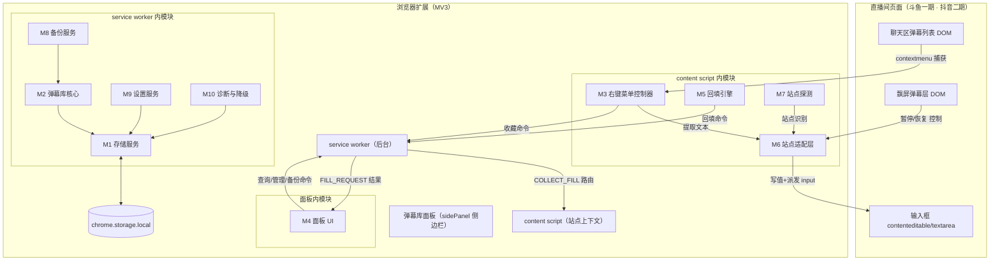
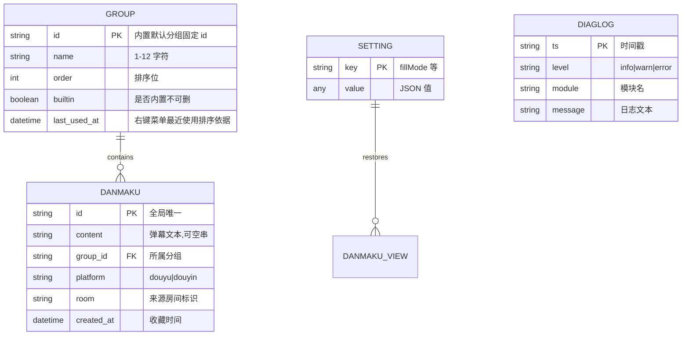
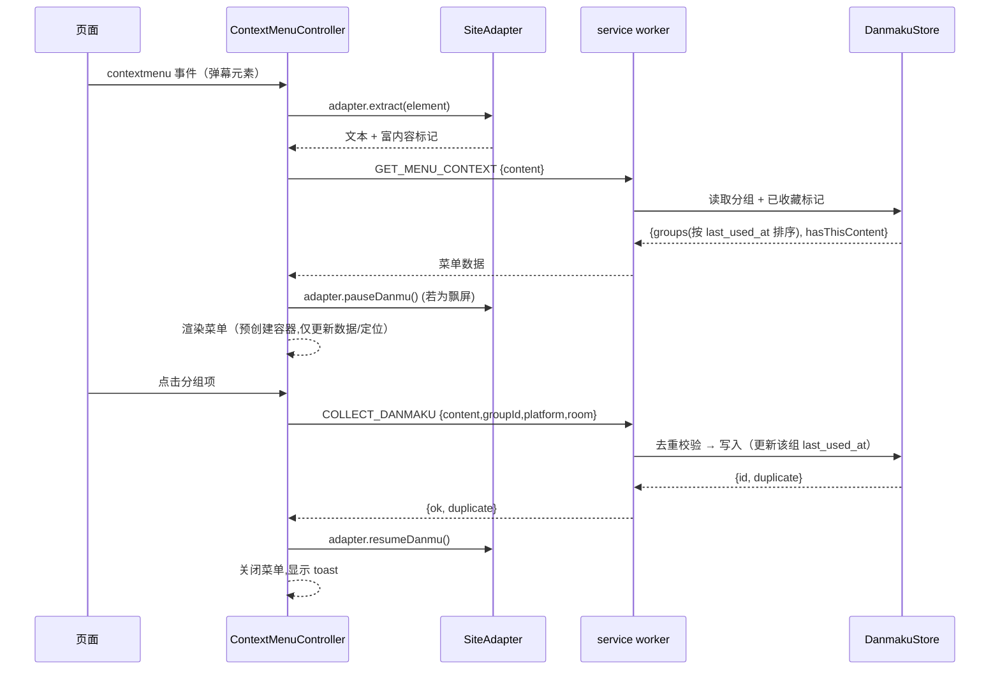
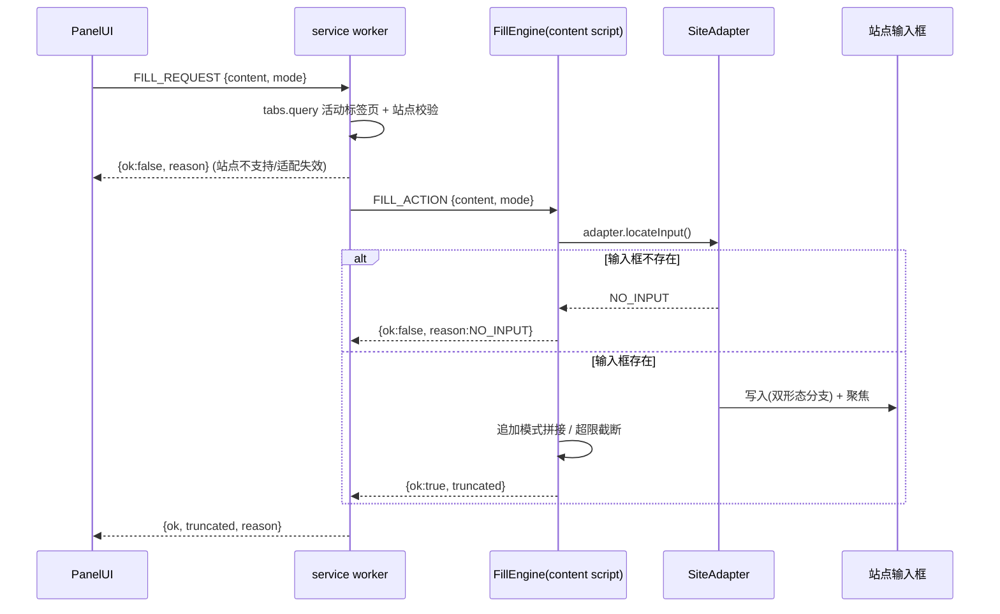
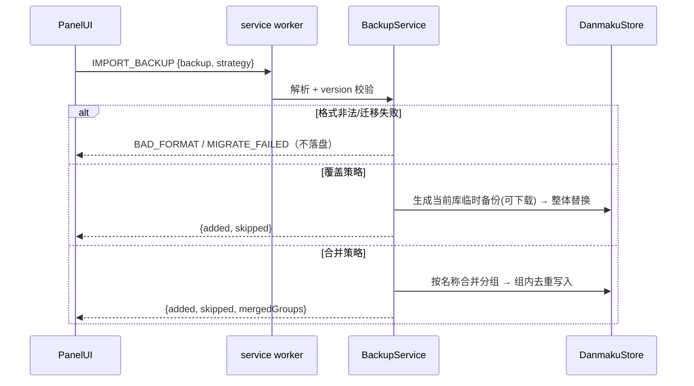

# 弹幕收藏管理插件 · 技术方案设计文档

| 文档属性 | 内容 |
|---------|------|
| 产品工作名 | 弹幕收藏夹（DanmakuBox） |
| 文档版本 | V0.2（评审修订稿） |
| 撰写日期 | 2026-08-28 |
| 撰写角色 | 技术负责人 |
| 上游文档 | PRD V1.2（评审修订稿）、原型设计 V0.2 |
| 文档状态 | 评审修订（技术评审 P1/P2 项已修正） |

### 修订记录

| 版本 | 日期 | 变更摘要 |
|------|------|---------|
| V0.1 | 2026-08-28 | 初稿：基于 PRD V1.2 与实地验证报告编写 |
| V0.2 | 2026-08-28 | 技术评审修订：数据模型补 GROUP.last_used_at 与消息协议 GET_MENU_CONTEXT（支撑右键菜单最近使用排序与已收藏标记）；面板形态评审裁决为 sidePanel 并补选型论证（否决 default_popup，保留独立页为备选）+ manifest 补 sidePanel/options_ui；SW 内存态迁移至 chrome.storage.session；Q3 与原型 D3 对齐（一期不做撤销）；里程碑补 P2.5 面板 UI 阶段；统一重复语义（duplicate 字段）；FILL_ACTION 补 DELIVERY_FAILED；写操作串行化机制明确为 Promise 队列；修正 mergeGroups 伪代码签名 |

> **证据标注约定**（全文统一使用）：
> - **[Data-backed]**：来自 PRD、实地验证报告、选择器字典中的实测数据或已确认结论（如斗鱼弹幕 50 字上限、飘屏哈希类名变更、抖音未登录不渲染）。
> - **[Expert judgment]**：技术负责人基于经验作出的设计决策，属本方案立场。
> - **[Hypothesis]**：尚未验证的假设，需在对应阶段验证。
> - **[Research-backed]**：外部公开依据，标注来源（Chrome 官方文档、Chrome Web Store 政策、可行性分析引用的第三方资料）。
> - **[Unverified — requires human review]**：无法在当前资料中核实、需人工评审确认的项，严禁在未确认前当作事实写入代码或排期。

---

## 1. 设计概述

### 1.1 目的与范围

本文档描述"弹幕收藏夹（DanmakuBox）"浏览器扩展（Chrome Extension · Manifest V3）的系统实现方案，回答"**how to build**"：模块划分、接口契约、数据模型、站点适配、非功能保障与实施计划。不重复 PRD 的功能定义（"what"），PRD V1.2 为唯一需求来源。

**一期范围**：斗鱼直播间（`*.douyu.com`）的弹幕右键收藏、弹幕库与分组管理、回填输入框、本地备份导出/导入。
**二期范围**：抖音直播间（`live.douyin.com`）站点适配器，复用一期全部通用层能力。
**明确不做**（技术层面同样约束）：任何云端同步、任何自动化发送、任何统计埋点、任何外部网络接口。

### 1.2 设计目标与约束

| 类别 | 目标 / 约束 | 来源 |
|------|------------|------|
| 隐私 | 零外部网络请求、零埋点、数据 100% 本地 | PRD G3、第 7 章隐私 |
| 性能 | 面板打开 ≤500ms；千条搜索 ≤300ms；右键菜单 ≤100ms；回填 ≤200ms | PRD 第 7 章性能 |
| 兼容 | Chrome / Edge（Chromium 内核）最新两个大版本，MV3 规范 | PRD 第 7 章兼容性 |
| 安全 | 不接触账号凭据、不代发、破坏性操作可挽回 | PRD 第 7 章账号安全、数据安全 |
| 稳定 | 单模块异常不拖垮整体；站点失效走降级提示而非报错中断 | PRD 第 7 章稳定性 |
| 复用 | 二期接入抖音不改动弹幕库/分组/备份的产品逻辑 | PRD G5、FR-06 |
| 工程 | 采用 TDD；每阶段交付可验证产物 | 本文档第 11 章 |

### 1.3 术语表

| 术语 | 技术定义（本文档语境） |
|------|------------------------|
| content script | 注入直播间页面的隔离脚本上下文，负责 DOM 交互 |
| service worker | MV3 后台上下文，承载数据入口与消息路由 |
| 弹幕库面板 | 插件 action 点击后打开的扩展页面（panel），承载管理 UI |
| 回填 | 将弹幕文本写入站点输入框并聚焦，不含发送 |
| 站点适配器 | 封装某直播站 DOM 差异的接口实现 |
| 选择器探测 | 对一组候选选择器做运行时可用性检测 |
| 降级两级原则 | 整站失效→明确提示；局部缺失→静默置灰 |
| 冒烟检测 | 注入后对站点核心锚点的最小存在性校验 |

---

## 2. 需求追溯矩阵

| 设计模块 | PRD 功能章节 | 对应性能目标 |
|---------|-------------|-------------|
| M1 StorageService | FR-05（存储层） | 写入失败可感知 |
| M2 DanmakuStore | FR-02 / FR-03 / FR-05 | 千条搜索 ≤300ms |
| M3 ContextMenuController | FR-01 / FR-06 | 右键菜单 ≤100ms |
| M4 PanelUI | FR-02 / FR-03 | 面板打开 ≤500ms |
| M5 FillEngine | FR-04 | 回填 ≤200ms |
| M6 SiteAdapter（Douyu/Douyin） | FR-06 / FR-01 / FR-04 | 适配状态实时可查 |
| M7 SiteDetector | FR-06 | 探测开销不影响页面 |
| M8 BackupService | FR-05 | 导入/导出响应性 |
| M9 SettingsService | FR-04 / FR-02（last_selected_group） | — |
| M10 Diagnostics | 第 7 章可观测性 | 诊断信息可导出 |

> 走查：十个模块覆盖 PRD 六个功能需求（FR-01~06）的全部实现面；性能目标逐项落到承载模块；M6 作为一期（斗鱼）与二期（抖音）的切换边界，支撑 PRD G5 复用要求。

---

## 3. 系统架构

### 3.1 架构图



**图 1 走查**：页面侧（左）提供三类 DOM 交互对象：聊天区列表（右键收藏主交互面）、飘屏层（暂停/恢复控制）、输入框（回填目标）。扩展侧分为三个上下文：content script 承载全部页面交互（M3/M5/M6/M7），service worker 作为数据与命令的唯一入口（M1/M2/M8/M9/M10），面板页仅承载 UI（M4）。数据流遵循"面板/内容脚本 → service worker → 存储"的单向写入路径；回填命令由 service worker 按活动标签页路由回 content script 执行，避免跨标签页误写。

### 3.2 架构风格

本方案采用**分层 + 适配器**风格：通用层（存储、弹幕库、备份、设置、诊断）与站点适配层（M6/M7）严格分离，站点差异被收敛在适配层接口之后。命令经 service worker 统一路由，属**中心协调型消息架构**（区别于 content script 直连存储的分散架构），以换取并发可控与可审计性。[Expert judgment]

### 3.3 组件职责边界

| 组件 | 上下文 | 职责 | 不负责 |
|------|--------|------|--------|
| content script | 页面 | 捕获右键、渲染菜单、执行回填 | 不直接写存储（除诊断日志） |
| service worker | 后台 | 数据入口、消息路由、备份、设置 | 不触碰页面 DOM |
| 弹幕库面板 | 扩展页面 | 展示与收集用户操作意图 | 不执行业务规则、不读写站点 DOM |
| chrome.storage.local | 浏览器 | 持久化 | — |

### 3.4 技术选型与理由

| 选型 | 决策 | 理由 |
|------|------|------|
| 扩展规范 | Manifest V3 | Chrome Web Store 自 2024 年起逐步淘汰 MV2，新上架扩展必须为 MV3 [Research-backed: Chrome 开发者文档 "Manifest V2 support timeline"]；MV3 强制 service worker 与最小权限模型，天然契合隐私目标 |
| 存储引擎 | `chrome.storage.local` | 数据仅本机、无需同步；结构化 JSON 读写 API 简单；配额约 10MB [Research-backed: Chrome 开发者文档 chrome.storage]，对纯文本弹幕绰绰有余（见 6.3 容量测算） |
| 配额应对 | 单 key 全量序列化 + 用量监控 + 导出清理引导 | 千条级弹幕约 200KB，远低于 10MB；达到 80% 用量告警并引导导出（PRD FR-05），避免超配额写入失败 [Expert judgment] |
| 后台宿主 | service worker | MV3 强制；无状态设计，依赖 chrome.runtime 消息唤醒 |
| 数据入口 | 仅 service worker 写存储 | 单一写入口降低多上下文并发写风险，符合 PRD"最后写入为准"策略 [Expert judgment] |
| 站点隔离 | 站点适配层接口 | PRD G5 要求二期不改通用层；接口化使新站点只增适配器不碰核心逻辑 |
| 右键菜单 | 页面内自定义浮层 | `chrome.contextMenus` 只能按 page/selection 等粗粒度上下文触发，无法定位到单条弹幕元素 [Research-backed: 斗鱼可行性分析 §3.1，引 chrome.contextMenus 局限] |
| 运行时依赖 | **零第三方运行时库** | 满足"不请求与产品功能无关的外部网络资源"的隐私约束（PRD 第 7 章）；缩小扩展包体与审查面；MV3 CSP 下远程脚本不可行，本地第三方库仍需审计供应链 [Expert judgment] |
| 语言/工程 | 原生 TypeScript + 原生 DOM API + ES Modules | 面板规模（列表/搜索/批量）无需重型框架；无运行时依赖约束下原生实现最简 |
| 网络 | 无任何外部网络接口 | 采集与回填均基于已渲染 DOM（不接斗鱼私有 TCP 协议、不接抖音 WebSocket 协议），规避协议逆向与签名成本 [Data-backed: 两份可行性分析均确认"无需接入私有协议"] |
| 注入方式 | 声明式 `content_scripts` | 不申请 `scripting` 权限，权限最小化；仅对已适配域名注入 |

---

## 4. 模块设计

> 每个模块给出五要素（职责/输入/输出/依赖/边界）。职责为单句表述，不含连接词。

### M1 存储服务 StorageService

| 要素 | 内容 |
|------|------|
| 职责 | 封装 `chrome.storage.local` 的读写、删除、用量查询。 |
| 输入 | 存储 key、值对象、回读 key 列表 |
| 输出 | Promise 化的读值、写入结果、用量统计 |
| 依赖 | chrome.storage API |
| 边界 | 不做业务校验；不感知弹幕/分组语义；不缓存（每次直读存储） |

### M2 弹幕库核心 DanmakuStore

| 要素 | 内容 |
|------|------|
| 职责 | 维护弹幕、分组、查询三类核心领域操作。 |
| 输入 | 弹幕对象、分组对象、查询参数（分组 id、关键词、排序键、页码） |
| 输出 | 弹幕列表、分组列表、去重判定、分页结果、变更汇总 |
| 依赖 | M1 StorageService、M9 SettingsService |
| 边界 | 不接触 DOM；不负责备份文件 I/O；不触发回填 |

> 说明：本模块部署于 service worker，作为存储唯一入口（见 3.2）。CRUD、分组、搜索、排序、去重、分页六类能力均在此实现，UI 与页面侧只经消息调用。

### M3 右键收藏 ContextMenuController

| 要素 | 内容 |
|------|------|
| 职责 | 在页面内渲染自定义右键菜单并上报收藏命令。 |
| 输入 | contextmenu 事件、目标弹幕文本、分组快照 |
| 输出 | 收藏/复制命令、菜单显隐事件、飘屏暂停/恢复指令 |
| 依赖 | M6 SiteAdapter（文本提取）、M2（经消息）、M9 |
| 边界 | 不直接访问存储；不做回填；不包含业务校验 |

### M4 面板 UI PanelUI

| 要素 | 内容 |
|------|------|
| 职责 | 渲染弹幕库面板的可视界面。 |
| 输入 | 用户操作事件、数据快照 |
| 输出 | 数据查询请求、收藏/回填/备份/设置命令、诊断导出请求 |
| 依赖 | M2/M5/M8/M9/M10（均经消息）、chrome.action |
| 边界 | 不含业务规则；不读写站点 DOM；不持久化任何状态（仅展示） |

### M5 回填引擎 FillEngine

| 要素 | 内容 |
|------|------|
| 职责 | 将弹幕文本写入目标站点输入框。 |
| 输入 | 弹幕文本、站点标识、回填模式（替换/追加） |
| 输出 | 回填结果（成功/截断/失败原因） |
| 依赖 | M6 SiteAdapter、M9 SettingsService |
| 边界 | 不触发发送动作；仅作用于当前活动标签页；不修改输入框外部页面结构 |

### M6 站点适配层 SiteAdapter

| 要素 | 内容 |
|------|------|
| 职责 | 封装各直播站点弹幕提取、回填、飘屏控制的差异。 |
| 输入 | 操作类型、目标元素、站点探测状态 |
| 输出 | 提取的弹幕文本、回填是否成功、适配能力状态 |
| 依赖 | M7 SiteDetector、站点选择器配置 |
| 边界 | 不含收藏业务；不依赖平台私有协议；一次实例绑定一个站点 |

### M7 站点探测 SiteDetector

| 要素 | 内容 |
|------|------|
| 职责 | 识别当前页面站点并判定适配状态。 |
| 输入 | location 信息、DOM 根元素 |
| 输出 | 站点标识、适配状态（正常/失效/未登录/不支持） |
| 依赖 | manifest 匹配配置、冒烟选择器清单 |
| 边界 | 只读探测；不执行任何业务操作；不触发网络请求 |

### M8 备份服务 BackupService

| 要素 | 内容 |
|------|------|
| 职责 | 执行弹幕库备份文件的导出、导入、合并。 |
| 输入 | 备份文件内容、导入策略（合并/覆盖） |
| 输出 | 导出数据对象、导入汇总（新增/跳过/合并分组） |
| 依赖 | M2 DanmakuStore、M9 SettingsService |
| 边界 | 不负责文件下载 UI；不执行破坏性操作前的确认逻辑（由调用方保证） |

### M9 设置服务 SettingsService

| 要素 | 内容 |
|------|------|
| 职责 | 维护全局设置与面板状态的读写、订阅。 |
| 输入 | 设置 key、值 |
| 输出 | 设置值、变更通知 |
| 依赖 | M1 StorageService |
| 边界 | 不包含弹幕业务规则；不感知平台差异 |

### M10 诊断与降级 Diagnostics

| 要素 | 内容 |
|------|------|
| 职责 | 沉淀本地诊断日志，生成诊断报告。 |
| 输入 | 日志事件、错误对象、适配状态快照 |
| 输出 | 环形诊断日志、可导出的诊断报告对象 |
| 依赖 | M1 StorageService |
| 边界 | 不采集用户行为数据；不上报任何外部；不参与业务判定 |

---

## 5. 接口设计

### 5.1 模块间接口清单

| # | 接口 | 调用方 → 被调方 | 载体 |
|---|------|----------------|------|
| I1 | `store.read/write/remove/usage` | 各模块 → M1 | 进程内调用（service worker 内） |
| I2 | `store.*`（CRUD/查询/去重/分页） | 消息路由 → M2 | 进程内调用 |
| I3 | `collect(content, groupId, platform, room)` | M3 → M2 | 消息（经 service worker） |
| I4 | `fill(content, mode)` | M4 → M5 | 消息（经 service worker 路由） |
| I5 | `adapter.extract/locate/fill/pause/resume/status` | M3/M5 → M6 | 进程内调用（content script 内） |
| I6 | `detect(location, root)` | M6 → M7 | 进程内调用 |
| I7 | `backup.export/import/merge` | M4 → M8 | 消息 |
| I8 | `settings.get/set/subscribe` | M2/M4/M5 → M9 | 进程内调用（service worker 内）+ 消息 |
| I9 | `diag.log/snapshot` | 全模块 → M10 | 进程内 + 消息 |

### 5.2 content script 与面板消息协议（完整定义）

消息经 `chrome.runtime.sendMessage` / `chrome.tabs.sendMessage` 传递，统一信封：

```
{ type: <消息名>, payload: <对象> }
返回: { ok: true, data } 或 { ok: false, error: { code, message } }
```

| 消息名 | 方向 | 参数 payload | 返回 data | 错误码 |
|--------|------|-------------|-----------|--------|
| `CS_READY` | content→background | `{site, tabId, status}` | `{}` | — |
| `GET_MENU_CONTEXT` | content→background | `{content}` | `{groups: [{id, name, order, last_used_at, builtin, hasThisContent}]}` | `READ_FAILED` |
| `COLLECT_DANMAKU` | content→background | `{content, groupId, platform, room}` | `{id, duplicate}` | `STORAGE_FULL`、`INVALID_CONTENT` |
| `LIST_DANMAKU` | panel→background | `{groupId, keyword, sort, page, pageSize}` | `{items, total, hasMore}` | `READ_FAILED` |
| `GET_GROUPS` | panel→background | `{}` | `{groups}` | `READ_FAILED` |
| `CREATE_GROUP` | panel→background | `{name}` | `{group}` | `NAME_EXISTS`、`NAME_INVALID`、`GROUP_LIMIT` |
| `RENAME_GROUP` | panel→background | `{id, name}` | `{group}` | `NAME_EXISTS`、`NAME_INVALID` |
| `DELETE_GROUP` | panel→background | `{id}` | `{movedCount}` | `BUILTIN_GROUP` |
| `REORDER_GROUPS` | panel→background | `{orderedIds}` | `{}` | `READ_FAILED` |
| `CREATE_DANMAKU` | panel→background | `{content, groupId}` | `{id, duplicate}` | `DUPLICATE`、`INVALID_CONTENT`、`STORAGE_FULL` |
| `UPDATE_DANMAKU` | panel→background | `{id, content}` | `{}` | `NOT_FOUND`、`INVALID_CONTENT` |
| `DELETE_DANMAKU` | panel→background | `{ids}` | `{deleted}` | `NOT_FOUND` |
| `MOVE_DANMAKU` | panel→background | `{ids, targetGroupId}` | `{moved}` | `NOT_FOUND` |
| `FILL_REQUEST` | panel→background | `{content, mode}` | `{ok, truncated, reason}` | `NO_ACTIVE_TAB`、`SITE_UNSUPPORTED`、`ADAPTER_DOWN`、`NOT_LOGGED_IN`、`NO_INPUT` |
| `FILL_ACTION` | background→content | `{content, mode}` | `{ok, truncated, reason}` | 同上（回执给 background 再回 panel） |
| `GET_SITE_STATE` | panel→background | `{}` | `{tabId, site, status, reason}` | `NO_ACTIVE_TAB` |
| `PROBE_REQUEST` | background→content | `{}` | `{site, status}` | — |
| `GET_SETTINGS` | panel→background | `{}` | `{settings}` | — |
| `SAVE_SETTINGS` | panel→background | `{patch}` | `{}` | `WRITE_FAILED` |
| `EXPORT_BACKUP` | panel→background | `{}` | `{backup}` | `READ_FAILED` |
| `IMPORT_BACKUP` | panel→background | `{backup, strategy}` | `{added, skipped, mergedGroups}` | `BAD_FORMAT`、`MIGRATE_FAILED` |
| `GET_DIAG` | panel→background | `{}` | `{diagnostics}` | `READ_FAILED` |
| `PANEL_OPENED/CLOSED` | panel→background | `{}` | `{}` | — |
| `GET_DOUYU_FAVORITE` | panel→background→content | `{}` | `{items}` | `NO_ACTIVE_TAB`、`SITE_UNSUPPORTED`、`DELIVERY_FAILED`、`NOT_LOGGED_IN`、`SOURCE_UNAVAILABLE` |
| `IMPORT_FAVORITE_DANMAKU` | panel→background | `{entries, groupId}` | `{added, skipped, invalid}` | `NOT_FOUND`、`WRITE_FAILED` |

**契约要点**：
- `FILL_REQUEST` 由 background 查询当前活动标签页（`tabs.query({active, lastFocusedWindow})`），按 `CS_READY` 维护的 `tabId→site` 映射校验站点，再经 `chrome.tabs.sendMessage` 下发 `FILL_ACTION`，content script 执行后将结果原路回执 [Expert judgment]。适配状态采用**实时判定**：不依赖注入时快照 status，而以 `FILL_ACTION` 执行回执为准——输入框缺失（`reason=NO_INPUT`）映射 `ADAPTER_DOWN`（解决斗鱼弹幕列表延迟渲染导致的过期误判，见 8.2/9.6）。
- `GET_SITE_STATE` 面板打开时经 `PROBE_REQUEST` 向 content 实时探测当前 DOM 的适配状态，覆盖注入快照的滞后（如弹幕列表延迟渲染导致的过期 `adapter_down`）；content 未回包（未就绪）时回退会话快照状态。
- `GET_MENU_CONTEXT` 为右键菜单渲染的数据来源：content script 捕获 `contextmenu` 后调用，一次取全"分组列表（含 last_used_at 排序）+ 该弹幕内容的已收藏标记（hasThisContent）"，菜单按返回数据渲染，服务 PRD FR-01"最近使用排序"与"已收藏标记"两项交互 [Data-backed: PRD FR-01]。空文本/超长弹幕的置灰判定在 content script 本地完成（不依赖此消息）。
- `FILL_ACTION` 下发失败（content script 未就绪、已卸载、tab 已关闭）返回 `DELIVERY_FAILED`，面板提示"直播页未就绪，请刷新后重试" [Expert judgment]。
- 重复语义统一：右键收藏与手动新建的重复判定均为"返回字段 duplicate=true（不视为错误）"；错误码 `DUPLICATE` 从 `CREATE_DANMAKU` 中移除，两入口行为一致。
- 写操作串行化机制：service worker 内维护 Promise 链式队列，所有写消息（COLLECT/CREATE/UPDATE/DELETE/MOVE/REORDER/IMPORT/SAVE_SETTINGS）入队后顺序执行，避免多面板窗口并发写相互覆盖 [Expert judgment]。
- SW 内存态持久化：`CS_READY` 维护的 `tabId→site` 映射与分组快照缓存写入 `chrome.storage.session`（随浏览器会话存续，SW 回收重启后自动恢复读取，不落磁盘）；SW 冷启动时若无映射（浏览器整体重启），由 `tabs.query` + 各已打开 tab 的 content script 重新上报 `CS_READY` 重建 [Expert judgment]。
- 错误码统一为稳定字符串，UI 侧映射为中文提示，不含堆栈细节，避免向页面上下文泄露内部信息。
- **存储变更驱动刷新**：面板监听 `chrome.storage.onChanged`（仅 local 区 + 本插件 key `db.danmaku`/`db.groups`，防抖 150ms 合并），content script 右键收藏等外部写入后自动刷新当前分组列表与分组计数，且保留用户的分组/关键词/排序状态。面板自身增删改后不再主动 `loadList`，统一由此驱动，避免重复加载（仅 `loadGroups` 即时更新分组 UI）[Data-backed: 2026-08 实测右键收藏后列表不自动刷新]。`selectAndLoad`（切换分组）等用户交互路径仍主动加载。
- **可见性补刷（2026-09-03 跨 tab 同步缺陷修复）**：`chrome.storage.onChanged` 为事件广播，但后台/冻结 tab 中的抽屉面板可能丢失该事件（Data-backed: 2026-09-03 实测页面 A 添加弹幕后，切换至已打开的页面 B 抽屉列表不刷新）。新增 `visibility-refresher`：文档 `visibilitychange→visible` 或窗口 `focus`（均文档可见态）时，300ms 防抖合并后触发与存储变更同路径的 `refreshPanel()`（`loadGroups`+`loadList`+`renderUsage`），保留用户筛选状态。事件驱动、无轮询；存储监听仍为前台主信号，可见性刷新为补漏信号。

**官方收藏导入接口核验（2026-09-02 实机）**：端点 `GET https://www.douyu.com/japi/privateCustomApi/favorite/web/bulletscreen/query`，cookie 鉴权、无签名参数、无网络分页（一次 query 返回全量，前端虚拟滚动仅窗口化渲染）；未登录时官方前端不发请求直接弹登录框，插件侧以 `acf_uid` cookie 探测登录态（`src/content/favorite-importer.ts`）。导入边界仅官方云端收藏，不含 DouyuEx 本地扩展库。

**导入冲突策略弹窗单选修复（2026-09-03 实测漏洞）**：`buildRadio` 构建了 `<label><input/><span>文案</span></label>` 完整结构却只 `return input`，label 与文案 span 游离于 DOM 外被丢弃，弹窗中仅见空圆圈、选项文字不可见。修复：返回整体 `label`（`appendChild(label)` 挂载），取值改为 `label.querySelector('input')!.checked`。同时给文案 span 加 `class="dk-radio-label"` + `color/font-size: inherit`，双重防止外部 CSS reset 隐藏。

### 5.3 导入导出 JSON 文件格式 Schema

```
{
  "version": 1,                 // 数据结构版本号，向前兼容导入（PRD FR-05 跨版本兼容）
  "exported_at": "2026-08-28T00:00:00+08:00",   // 导出时间，ISO 8601
  "danmaku": [
    { "id": "d_...", "content": "666", "group_id": "g_...", "platform": "douyu", "room": "1126960", "created_at": "..." }
  ],
  "groups": [
    { "id": "g_default", "name": "默认收藏", "order": 0 }
  ],
  "settings": [
    { "key": "fillMode", "value": "replace" },
    { "key": "fillAfterBehavior", "value": "focus_only" },
    { "key": "chatContextMenuEnabled", "value": true },
    { "key": "last_selected_group", "value": "g_..." }
  ]
}
```

字段校验规则：`version` 必须存在且为受支持整数；`danmaku[].content` 允许为空字符串（对应空文本条目，PRD FR-01）；`group_id` 须能在 `groups` 中解析，无法解析的弹幕归入"默认收藏" [Expert judgment]。版本迁移失败时中止导入并保留原库（PRD FR-05 边界）。

**存储与导出的形态转换**：本地存储中 `db.settings` 为键值对象 `{key: value}`（读写便捷）；导出时序列化为 `settings` 数组 `[{key, value}]`（自描述、便于人工检查与跨版本迁移），导入时反向合并（设置以当前库为准，PRD FR-05），转换在 BackupService 内收敛完成 [Expert judgment]。

### 5.4 网络接口约束

本产品**不实现任何外部网络接口**：无 fetch/XHR/WebSocket 调用、无 CDN 资源加载、无埋点上报端点。manifest 仅声明 `storage`、`tabs`、`sidePanel` 权限与目标域名 `host_permissions`（见 9.2），从权限层面杜绝隐式网络行为 [Expert judgment]。

---

## 6. 数据设计

### 6.1 实体关系图



**图 2 走查**：核心关系为 `GROUP` 一对多 `DANMAKU`（分组→弹幕，弹幕必须归属一个分组，删除分组时弹幕移入内置默认组而非级联删除，见 6.2）。`SETTING` 与 `DANMAKU_VIEW` 的"restores"关系表示 `last_selected_group` 设置决定面板打开时恢复的列表视图（视图状态，非持久实体）；`GROUP.last_used_at` 支撑右键菜单"最近使用"排序。`DIAGLOG` 为本地诊断环形日志（上限 200 条），与业务数据隔离存储，不参与任何查询。

### 6.2 实体约束

| 实体 | 字段 | 约束 |
|------|------|------|
| 弹幕 | id | 全局唯一（时间戳+随机后缀） |
| 弹幕 | content | 0~50 字符（斗鱼实测上限 [Data-backed]）；空串仅允许来自空文本弹幕收藏，禁止手动新建为空 |
| 弹幕 | group_id | 非空；引用存在的分组 |
| 分组 | id | 内置"默认收藏"使用固定 id（如 `g_default`），不可删除、不可重命名 [Data-backed: PRD FR-03] |
| 分组 | name | 1~12 字符；同库内唯一 |
| 分组 | 数量 | 上限 50 个（含内置）[Data-backed: PRD FR-03 假设-待验证] |
| 分组 | last_used_at | 右键菜单"最近使用"排序依据，收藏动作时更新；允许为空（按 order 兜底排序）|
| 设置 | key | 枚举集合（fillMode/fillAfterBehavior/chatContextMenuEnabled/last_selected_group），未知 key 忽略 |

### 6.3 存储 key 划分与序列化

| 存储 key | 内容 | 序列化 |
|---------|------|--------|
| `db.danmaku` | 弹幕数组 | JSON.stringify 单 key 存储 |
| `db.groups` | 分组数组 | JSON 单 key |
| `db.settings` | 设置对象 | JSON 单 key |
| `diag.logs` | 环形诊断日志 | JSON 单 key |
| `meta.schemaVersion` | 数据版本号 | 数值 |

> 采用"全量读写、单 key"而非增量分片，理由：千条级数据单次 JSON 序列化 <1ms [Expert judgment]，实现简单且天然满足"最后写入为准"的并发策略（PRD FR-05）；仅当单库达到万条量级时再评估分片迁移。

**容量测算**：斗鱼弹幕内容上限 50 字符（UTF-8 中文约 150 字节），加元数据估算单条弹幕 ≤200 字节；1000 条 ≈ 200KB；`chrome.storage.local` 配额 10MB [Research-backed: Chrome 开发者文档]，理论可容纳约 5 万条弹幕。面板底部常驻显示用量，达 80%（8MB）告警引导导出清理（PRD FR-05）。[Expert judgment：单条体积估算]

### 6.4 容量与分页策略

- **分页**：每页 50 条（PRD FR-02 [Data-backed]），滚动触底加载下一页；滚动容器 DOM 节点数恒定（仅渲染当前页），保证大库下 UI 流畅。
- **搜索（千条级 ≤300ms 实现）**：查询时全量读取后建内存数组，按 `keyword` 对 `content` 做 `includes` 匹配（不区分大小写、中文检索无需分词 [Expert judgment]），再按排序键（`created_at` / `content.length`）排序，取当前页。1000 条遍历与过滤耗时为毫秒级，主瓶颈在渲染，故将渲染控制在当前页 50 条内，实测预算内达标 [Expert judgment]。
- **排序**：最新收藏（`created_at` 倒序）、最早收藏、内容长度（`content.length`）。
- **搜索作用域**：限定当前分组，选中"全部弹幕"时为全库（PRD FR-02）。

### 6.5 备份文件结构

备份文件与本地存储共用数据模型（PRD FR-05），结构即 5.3 的 JSON Schema；导出时从 `db.danmaku`、`db.groups`、`db.settings` 快照生成，`version` 取当前 `meta.schemaVersion`。导入时按 `version` 迁移（当前仅 v1，迁移器为幂等函数，失败抛 `MIGRATE_FAILED` 且不落盘）。

---

## 7. 关键流程设计

### 7.1 右键收藏流程



**图 3 走查**：右键事件在 content script 内被捕获并拦截默认菜单；文本提取与飘屏暂停经适配层完成；菜单数据（分组列表按 `last_used_at` 排序、已收藏标记）经 `GET_MENU_CONTEXT` 从 service worker 一次取全，右键菜单 ≤100ms 的性能目标要求该消息往返与菜单更新在预算内（菜单容器预创建，仅更新数据与定位）；收藏命令发给 service worker 由 DanmakuStore 去重后写入并更新该分组 `last_used_at`，结果原路返回；菜单始终在用户点击后即刻关闭并恢复飘屏运动。`duplicate=true` 时不重复写入（PRD FR-01"已收藏"标记）。

### 7.2 回填流程



**图 4 走查**：回填请求自面板发出，service worker 校验当前活动标签页后路由至对应 content script；输入框定位与写入全在适配层内完成（含 contenteditable/textarea 双形态分支与 React 受控组件的原型 setter + `input` 事件派发 [Data-backed: 实地验证"innerText+input 事件"范式成功]）；发送动作由用户手动完成，不在任何路径中触发 [Data-backed: PRD 2.3 产品原则]。

### 7.3 导入合并流程



**图 5 走查**：导入先做格式与版本校验，失败即止；覆盖策略执行前强制产出当前库临时备份文件供下载（PRD FR-05 可挽回要求）；合并策略按"同名分组按名称合并、设置以当前库为准"的规则执行（PRD FR-05），重复条目跳过。

### 7.4 非平凡算法伪代码

**7.4.1 去重算法（内容 + 分组 双重维度）**

```
function findDuplicate(danmakuList, content, groupId):
    normalized = normalize(content)          // 去除首尾空白；全角/半角不做折叠[Expert judgment]
    for item in danmakuList:
        if item.group_id == groupId:
            if normalize(item.content) == normalized:
                return item
    return null

// 使用点：右键收藏、面板手动新建均调用；命中则提示"该分组已收藏此弹幕"，不写入
```

**7.4.2 同名分组合并算法（导入-合并）**

```
function mergeGroups(currentGroups, currentDanmaku, incomingGroups, incomingDanmaku):
    result = copy(currentGroups)                          // 分组结果
    danmakuByGroup = groupBy(currentDanmaku, group_id)    // 现有弹幕按组索引
    nameIndex = { g.name -> g.id for g in result }        // 现有组按名称建索引
    addCount = 0; skipCount = 0; merged = 0

    for g in incomingGroups (按 order 顺序):
        if nameIndex has g.name:
            targetId = nameIndex[g.name]                  // 按名称合并到现有组
            merged += 1
        else:
            targetId = newId()
            result.append({ id: targetId, name: g.name, order: nextOrder(result) })
            nameIndex[g.name] = targetId

        for d in incomingDanmaku where d.group_id == g.id:
            if findDuplicate(danmakuByGroup[targetId], d.content, targetId) == null:
                danmakuByGroup[targetId].append(d)
                addCount += 1
            else:
                skipCount += 1
    return { groups: result, added: addCount, skipped: skipCount, mergedGroups: merged }
```

**7.4.3 选择器多候选探测策略**

```
function probeSelectors(candidates, root):
    // candidates: 有序候选数组，如 [hi级语义类名, mid级, verify级哈希, data-e2e]
    for { selector, kind } in candidates:
        elements = root.querySelectorAll(selector)
        for el in elements:
            if passesSmoke(el):          // 冒烟：元素可见、含预期子结构（如文本节点）
                return { el, selector, kind }
    return null

// 使用点：SiteDetector 实例化前冒烟（如 .ChatSend-txt 与 .Barrage-list 存在性）；
// 适配器内部对易变哈希类名（如 .danmu-*）用特征探测 [Data-backed: 斗鱼飘屏类名 e7f029→fbb2a3 已实测变更]
```

---

## 8. 站点适配器设计

### 8.1 适配器接口定义

```ts
interface SiteAdapter {
  readonly site: 'douyu' | 'douyin';
  probe(root: Document): ProbeResult;            // 冒烟检测：核心锚点是否存在
  extract(element: Element): { text: string; hasRichContent: boolean };
  locateInput(): HTMLElement | null;             // 返回输入框（双形态归一）
  fill(text: string, mode: 'replace'|'append'): FillResult; // 写入+聚焦，不发送
  pauseDanmu(): void;   // 飘屏暂停（仅飘屏路径）
  resumeDanmu(): void;  // 飘屏恢复
  getLoginState(): 'logged_in' | 'logged_out' | 'unknown';  // 抖音必用
  getRoomId(): string;
}
```

接口设计要点：`fill` 内部统一处理 React 受控组件写入范式（原型 setter + `InputEvent` 派发，[Data-backed: 实地验证 innerText+input 范式成功；可行性分析强调直接赋值无效]）；`probe` 供 SiteDetector 冒烟；`getLoginState` 仅抖音实现返回有效值，斗鱼返回 `unknown`（斗鱼未登录亦可回填 [Data-backed: 实地验证]）。

### 8.2 斗鱼适配器 DouyuAdapter（一期）

| 项 | 设计 |
|----|------|
| 选择器清单 | 引用《斗鱼 DOM 选择器字典》（selector-dict.md）；主干用 hi 级语义类名：`#js-barrage-list`/`.Barrage-list`（列表）、`.Barrage-listItem`（条目）、`.Barrage-content`（文本）、`.ChatSend-txt`（输入框，实测 DIV+contenteditable）、`.ChatSend-button`（发送按钮）、`.Barrage-nickName`、`.is-self` [Data-backed] |
| 锁屏工具条遮挡 | 聊天区顶部 `.Barrage-topFloater` 会拦截其覆盖范围内弹幕的鼠标事件 [Data-backed: 实地验证]。处理：右键触发时检测命中元素是否被工具条覆盖，若覆盖则临时提升自定义菜单层级至工具条之上（z-index 高于浮层），并将菜单定位到鼠标坐标；同时对该条弹幕改用坐标级命中（`document.elementFromPoint`）确保取到弹幕文本 [Expert judgment] |
| 飘屏暂停/恢复 | 飘屏元素类名易变（`.danmu-e7f029`→`.danmu-fbb2a3` 已变更 [Data-backed]），不做硬依赖：用 `[class*="danmu"]` 特征探测定位飘屏容器，通过注入 `animation-play-state: paused` 样式类暂停全部飘屏，右键完成或菜单关闭后移除该类恢复 |
| 输入框双形态兼容 | `locateInput()` 先查 `.ChatSend-txt`，判断形态：若 `contenteditable=true` 走 DIV 分支（`innerText` 赋值 + `input` 事件），否则走 textarea 分支（原型 setter + `input` 事件）；当前线上为 DIV 形态，双分支保留以兼容历史版本 [Data-backed: 实地验证确认当前为 DIV 形态，selector-dict 记录双形态] |
| 原生右键面板共存 | 自定义菜单在原生面板出现位置偏移展示（Q1 待登录态复测后定版，见第 10 章开放问题承接） |
| 冒烟检测 | 实例化前检测 `.ChatSend-txt`（**必需锚点**，回填仅依赖输入框）；`.Barrage-list` 为**可选锚点**——随 WebSocket 首条消息延迟渲染（实测约 9s），缺失仅记录 `missing`、不判定适配失效 [Data-backed: 实地验证 + 2026-08 修复] |

### 8.3 抖音适配器 DouyinAdapter（二期）

| 项 | 设计 |
|----|------|
| 锚点策略 | 抖音类名为纯哈希（无语义前缀），改用 `#chatroom` 稳定 ID + `data-e2e` 测试属性体系（15+ 个）为锚点主干 [Data-backed: 实地验证]。输入框候选：`data-e2e="chat-send-input"` / `.webcast-chatroom___textarea`（历史记录，作为 verify 级候选）[Research-backed: 抖音可行性分析 §3.3 引 douyin-comment-app] |
| 登录态检测 | `getLoginState()` 检测 `data-e2e="user-info"` 是否出现及 `sessionid` cookie 是否存在 [Research-backed: 抖音可行性分析 §3.3 引 douyin-comment-app]；未登录时弹幕列表与输入框均不渲染 [Data-backed: 实地验证]，适配器向 M10 上报 `NOT_LOGGED_IN`，回填入口置灰并给出登录引导 |
| 未登录降级 | 属于"整站局部能力缺失"：收藏与回填置灰/提示，弹幕库浏览、分组、备份不受影响 [Data-backed: PRD FR-06] |
| 飘屏路径 | **待二期登录态验证**：未登录无弹幕 DOM，无法探测飘屏实现方式（DOM/Canvas）[Data-backed: 实地验证裁决 Q5]；登录态验证通过后再决定是否纳入，默认以评论列表为主交互面 [Research-backed: 抖音可行性分析 §3.1 建议] |
| 冒烟检测 | 检测 `#chatroom` 存在性 + `data-e2e` 体系任一锚点 |

---

## 9. 非功能设计

### 9.1 性能目标对照与实现策略

| 目标 | 实现策略 |
|------|---------|
| 面板打开 ≤500ms | 面板打开即发 `LIST_DANMAKU`/`GET_GROUPS` 拉取数据；首屏仅渲染当前页 50 条；`db.*` 读取与 JSON 解析在千条级下 <5ms [Expert judgment] |
| 千条搜索 ≤300ms | 输入防抖 100ms；内存 `includes` 过滤 + 排序（毫秒级）；结果分页渲染，滚动容器 DOM 数恒定（见 6.4） |
| 右键菜单 ≤100ms | 菜单容器在 content script 注入时预创建并隐藏，右键时仅更新数据与定位（DOM 操作最小化）；分组快照由 service worker 缓存同步 [Expert judgment] |
| 回填 ≤200ms | 适配器缓存输入框引用，回填时仅做存在性校验后同步写入+聚焦，无跨帧等待 |

> 注：以上为设计目标与策略，实际验收以 PRD 第 7 章数值为准，测试方法见第 11 章验证阶段。

### 9.2 manifest 权限最小化清单

```json
{
  "manifest_version": 3,
  "name": "弹幕收藏夹 DanmakuBox",
  "permissions": ["storage", "tabs", "sidePanel"],
  "host_permissions": ["*://*.douyu.com/*"],
  "content_scripts": [{
    "matches": ["*://*.douyu.com/*"],
    "js": ["content.js"],
    "run_at": "document_idle"
  }],
  "side_panel": { "default_path": "panel.html" },
  "options_ui": { "page": "settings.html", "open_in_tab": true }
}
```

- `storage`：本地持久化必需。
- `tabs`：回填需在后台上下文查询任意活动标签页 URL 以路由 `FILL_REQUEST`（`activeTab` 仅在用户显式交互时授予单页临时权限，无法满足后台查询，且 host_permissions 覆盖域名的权限不自动授予 `tabs.query` 的 url 读取 [Research-backed: Chrome tabs 权限文档]）。
- `sidePanel`：面板形态采用浏览器侧边栏（见 9.2.1 选型论证）。
- **不申请** `contextMenus`（自定义菜单）、`scripting`（声明式注入）、`downloads`（面板页 `<a download>` 导出）、`cookies`（不代登/不触凭据）、任何网络权限。二期新增 `*://live.douyin.com/*` host 权限。
- `options_ui`：承载设置页（原型 D4 设置入口之一），`open_in_tab: true` 以独立标签页打开，避免弹窗内嵌布局受限。
- 隐私声明在安装页明示"零上传、零埋点、纯本地"（PRD 第 7 章隐私）。

#### 9.2.1 面板形态选型：sidePanel（评审裁决）

| 候选 | 结论 | 理由 |
|------|------|------|
| **sidePanel（选定）** | 采用 | 回填后面板失焦不自动关闭，用户可在直播间验证输入框内容后返回面板继续挑选（PRD FR-04 回填后行为依赖面板存续）；列表布局无 popup 600px 高度上限约束；Chrome/Edge 均已支持侧边栏 API |
| default_popup | 否决 | popup 失焦即关：点击回填转向直播间瞬间，面板连同"已回填"提示一起消失，与回填主流程直接冲突；且 600px 高度上限压制弹幕列表 |
| 独立标签页 | 备选 | 保留为兼容方案：sidePanel 不可用（旧版浏览器）或用户偏好时可由设置项切换 |

实现要点：`chrome.sidePanel.setPanelBehavior({ openPanelOnActionClick: true })` 使插件图标点击即开侧边栏（service worker 初始化时设置）[Research-backed: Chrome Side Panel 官方文档]；面板宽约 720px 的布局要求以侧边栏默认宽度可承载（侧边栏宽度用户可拖拽调整，布局按自适应设计）。

### 9.3 CSP 与安全

- MV3 默认 CSP 禁止远程脚本，本项目零第三方运行时依赖，无远程代码注入面 [Expert judgment]。
- 不执行 `eval`/`new Function`；模板渲染使用文本节点或 `textContent`，杜绝弹幕内容造成 XSS（弹幕文本来自站外，必须按不可信数据处理）[Expert judgment]。
- 仅通过 `chrome.runtime` 消息通信，不暴露页面可调的敏感接口；消息做类型白名单校验。

### 9.4 兼容性

- 目标：Chrome / Edge（Chromium 内核）发布时最新两个大版本，MV3 规范 [Data-backed: PRD 第 7 章兼容性]。
- 具体版本号随发布周期确定，列为 [Unverified — requires human review]。
- 使用 ES2020 语法与标准 Web API，避免前沿特性依赖。

### 9.5 可观测性（不埋点约束下）

- **本地诊断日志**：M10 将关键事件（适配器冒烟结果、回填成败、存储错误、版本号）写入 `diag.logs` 环形缓冲（上限 200 条），仅存本机，不上报 [Expert judgment]。
- **导出诊断信息**：面板设置区提供"导出诊断信息"，生成含扩展版本、浏览器版本、各适配器状态、最近日志、存储用量的文本/JSON，供用户反馈问题时人工分析。
- 刻意不采集用户行为轨迹，符合 PRD 隐私要求。

### 9.6 错误处理与降级两级原则

| 级别 | 情形 | 行为 |
|------|------|------|
| 整站适配失效 | 回填时实时判定：必需锚点（输入框）缺失（`FILL_ACTION` 回执 `reason=NO_INPUT` 或 `PROBE_REQUEST` 探测失败） | 明确状态提示（"斗鱼适配暂不可用，等待插件更新"），回填置灰并给兜底（复制文本），不静默 [Data-backed: PRD FR-06 降级两级原则]。判定实时化：不依赖注入时快照，避免弹幕列表延迟渲染导致的过期误判（见 8.2） |
| 局部能力缺失 | 弹幕位于 iframe 内右键不可用、飘屏定位失败、抖音未登录 | 该入口置灰或静默跳过，不影响其余功能与观看 [Data-backed: PRD FR-06] |

所有模块错误经统一错误码返回 UI，UI 映射为中文提示；单模块异常不向上抛未捕获错误，避免拖垮页面与面板（PRD 第 7 章稳定性）。

### 9.7 扩展上下文失效防护（Extension Context Guard）

dev 流程（重载扩展 / service worker 失效）后，老 content script 仍驻留已打开的直播间页面，其持有的 `chrome.*` 引用全部失效。任何 chrome API 调用会**同步抛出** "Extension context invalidated"（不走 promise reject，`.catch()` 抓不住），错误冒泡到全局 → Chrome 错误面板显示 → 污染页面。**[Data-backed: 2026-09-02 dev 走查复现，错误堆栈指向 content.js `adapter.probe` 行附近]**

| 防护点 | 行为 | 落地位置 |
|--------|------|----------|
| 同步抛错转 catch | `safeSendMessage(api, msg)` 包裹 `chrome.runtime.sendMessage`，识别错误消息含 "Extension context invalidated" 时返回 `CONTEXT_INVALIDATED`；其他同步 throw 归为 `SEND_FAILED` | `src/content/extension-context.ts` |
| 启动期前置 guard | `isContextValid(api)` 检测 `chrome.runtime.id` 存在；失效则**不调用** sendMessage，直接返回 `CONTEXT_INVALIDATED`，避免在已失效上下文上无谓重试 | `src/content/extension-context.ts` |
| 启动期调用改造 | `index.ts` 的 `CS_READY` 上报改用 `safeSendMessage(chrome, ...)`（替代裸 `chrome.runtime.sendMessage().catch()`，后者抓不住同步异常） | `src/content/index.ts` |
| 业务调用复用既有 | 业务向 SW 的消息（`COLLECT_DANMAKU` / `GET_MENU_CONTEXT` / `FILL_REQUEST` 等）继续走 `shared/messaging.ts` sendMessage（已 try/catch 异步 reject 路径），不动 | `src/shared/messaging.ts` |
| 错误码 | 新增 `CONTEXT_INVALIDATED`，区别于既有 `SEND_FAILED` / `NO_RESPONSE`，便于诊断 | `src/shared/types.ts`（Result.error.code 枚举） |

**设计原则（融入而非改造）**：
- 不重试、不弹 UI 提示、不主动清理老 content script（Chrome 自身已通过世界隔离处理）。失效是 dev 偶发现象，不打扰普通用户。
- 依赖注入（`api: typeof chrome`）便于单测覆盖同步抛错场景，**纯函数**不依赖真实 chrome 全局。
- 不在 `onMessage` listener 内部加 guard：消息到达时回调内不再调 chrome API（fillEngine / drawer 都是纯 DOM 操作），无需重复防护。
- drawer host 的 `getURL` / `storage.session` 暂不改造：drawer 运行时失效属另一种场景（如页面 onMessage 触发），按需后续扩展，避免单次 PR 范围爆炸。

关联 spec：`docs/superpowers/specs/2026-09-02-extension-context-guard.md`。

---

## 10. 风险与对策

### 10.1 风险登记表

| # | 风险 | 概率 | 影响 | 缓解措施 |
|---|------|------|------|---------|
| R1 | Chrome Web Store 上架审核风险（权限/隐私披露审查） | 中 | 上架延迟或驳回 | 权限最小化（9.2）；安装页隐私披露；审核材料提前准备 [Research-backed: Chrome Web Store 开发者政策要求权限最小化与隐私披露] |
| R2 | 站点选择器变更（斗鱼哈希类名、抖音改版频繁） | 高 | 局部能力失效 | hi 级语义类名主干 + 哈希类名多候选特征探测（7.4.3）；选择器集中配置便于热修 [Data-backed: 飘屏类名已实测变更] |
| R3 | 平台整站改版导致核心锚点失效 | 中 | 收藏/回填不可用 | 冒烟检测 + 两级降级提示（9.6）；插件更新日志标注恢复状态 [Data-backed: PRD FR-06] |
| R4 | storage 容量超限（收藏量极大） | 低 | 写入失败丢数据 | 用量常驻显示 + 80% 告警引导导出清理；写入失败明确 toast 不静默 [Data-backed: PRD FR-05] |
| R5 | 斗鱼原生右键面板共存形态（Q1）未定 | 中 | 一期右键交互返工 | 登录态复测后定版（见 10.2）；实现上保留菜单偏移方案可配置 |
| R6 | 抖音飘屏路径（Q5）未验证 | 中 | 二期范围膨胀 | 二期先以评论列表为主交互面，飘屏待登录态验证后单独决策 [Data-backed] |
| R7 | 回填"追加模式"（Q2）站内拼接校验未实测 | 低 | 追加模式发送被站方拦截 | 按"只回填不代发"原则降级为低优先级，不做实测投入 [Data-backed: PRD 开放问题 Q2] |
| R8 | 多窗口并发修改 | 低 | 覆盖写入 | 单写入口 + 最后写入为准（与 PRD 策略一致）；多窗口出现频率待观察 [Data-backed: PRD FR-05] |
| R9 | service worker 生命周期：闲置回收导致消息路由中断 | 中 | 偶发命令无响应 | 消息驱动唤醒（onMessage 自动拉起）；回填/收藏命令幂等设计，失败可重试 [Expert judgment] |
| R10 | 抖音风控（涉及自动化发送） | 中 | 用户账号受限 | 只回填不代发，发送由用户手动完成；插件不做任何自动发送 [Data-backed: 抖音可行性分析结论] |
| R11 | 富内容/表情弹幕文本提取异常 | 低 | 收藏内容残缺 | `extract()` 仅取纯文本并标记富内容，toast 注明忽略表情/图片 [Data-backed: PRD FR-01] |
| R12 | 弹幕内容 XSS 风险（来自站外不可信数据） | 低 | 页面脚本注入 | 一律 `textContent` 渲染、禁用 eval、消息白名单（9.3）[Expert judgment] |

### 10.2 开放问题承接表

| 开放问题（PRD 第 8 章） | 技术承接与处理 |
|------------------------|---------------|
| Q1 斗鱼原生右键面板共存形态 | 依赖登录态复测；菜单偏移方案已按可配置实现，复测后评审定版；列入里程碑"验证阶段"前置验收项 |
| Q2 回填追加模式可用性 | 保留设置项但功能标记低优先级；追加拼接逻辑（`append` 分支）实现为隔离模块，站内校验行为 [Unverified — requires human review] |
| Q3 删除撤销窗口（5 秒 toast） | 与原型 D3 对齐：一期按"行内确认 + 立即删除"实现，不做撤销窗口与软删除；若产品后续将撤销纳入范围，另行评审（需新增 UNDO 消息与延迟落盘机制） [Data-backed: 原型差异 D3 待评审项] |
| Q4 弹幕字数上限 | 已关闭：content 上限 50 字符，由适配层按平台维护上限值 [Data-backed] |
| Q5 抖音飘屏路径 | 待登录态验证；二期范围按验证结果决策（见 8.3） |
| Q6 清空二次确认强度 | 属于交互细节，技术侧在 BackupService 保证"清空前先产出临时备份下载"的不可变契约，确认强度由产品/设计定 [Data-backed: PRD FR-05] |

> 风险与开放问题中标注 [Unverified — requires human review] 的项，均需在对应里程碑（登录态复测、上线前评审）人工复核后方可定版，不得在代码中硬编码假设值。

---

## 11. 里程碑与任务拆分

> 工程总则：**TDD**——每个阶段先编写测试（单元/契约测试），再实现；验证方式含自动化测试与人工走查。里程碑依赖关系：存储 → 弹幕库 → 交互（右键/回填）→ 适配器 → 备份 → 验证。

| 阶段 | 名称 | 交付物 | 验证方式 |
|------|------|--------|---------|
| P0 | 脚手架 | manifest.json、目录结构（content/background/panel/settings/shared）、sidePanel 骨架、options_ui、测试框架、TS 编译配置 | 空扩展可加载；图标点击打开侧边栏面板；测试桩可运行 |
| P1 | 存储服务 | M1 StorageService 实现（含 storage.session 持久化层） | 单元测试（mock chrome.storage）：读写/删除/用量/失败路径/会话态恢复 |
| P2 | 弹幕库核心 | M2 DanmakuStore（CRUD/分组/搜索/排序/去重/分页/last_used_at 维护）、M9 SettingsService | 单元测试覆盖：去重算法、同名分组合并、分页边界、50 分组上限、排序正确性 |
| P2.5 | 面板 UI | M4 PanelUI（sidePanel 面板页：列表/搜索/分组导航/批量管理/存储用量区 + 消息协议对接） | 面板契约测试（LIST_DANMAKU/GET_GROUPS 等全消息）+ 人工走查 G2 操作路径 |
| P3 | 右键收藏 | M3 ContextMenuController + M7 SiteDetector 骨架 + GET_MENU_CONTEXT 链路 | content script 集成测试：事件捕获、菜单渲染（含已收藏标记与最近使用排序）、收藏命令链路 |
| P4 | 回填 | M5 FillEngine + DouyuAdapter 输入框适配 | 斗鱼页面人工验证 + 回填契约测试（contenteditable 分支） |
| P5 | 适配器完善 | DouyuAdapter 完整（飘屏暂停/恢复、锁屏工具条遮挡、双形态输入框、冒烟检测） | 斗鱼直播间人工走查：聊天区收藏、飘屏收藏、遮挡场景、回填双形态 |
| P6 | 备份 | M8 BackupService（导出/导入/合并/覆盖/迁移）+ 设置页（options_ui） | 单元测试（合并算法、跨版本迁移失败不落盘）+ 面板人工验证导出导入 |
| P7 | 验证 | 性能测试、兼容性回归、诊断导出、M10 收尾 | 性能打点对照 PRD 第 7 章；Chrome/Edge 双内核冒烟；**登录态复测（Q1/Q5）** 前置验收 |

### 11.1 里程碑表

| 里程碑 | 完成条件 |
|--------|---------|
| M1 内部可跑通收藏 | P0~P3 完成：右键可收藏、面板可管理（本地环境加载扩展） |
| M2 一期功能完成 | P4~P6 完成：回填、备份、完整斗鱼适配 |
| M3 一期达标 | P7 通过：性能/兼容/登录态复测（Q1/Q5）全部裁决，开放问题定版 |
| M4 二期抖音 | 新增 DouyinAdapter，登录态检测联调，弹幕库零改动 [Data-backed: PRD G5] |

> 里程碑验收以 PRD 第 7 章非功能要求与 FR-01~06 验收口径为准；任一 [Unverified — requires human review] 项未复核前，对应里程碑不得标记完成。

---

*文档完 · V0.2 技术方案评审修订稿*
